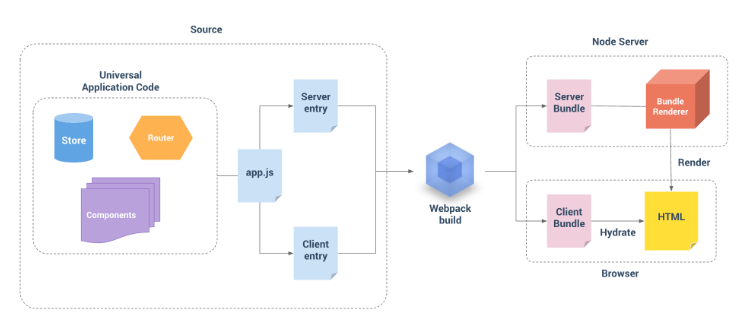

## Vue笔记

### 一、Vue中的指令

v-for循环

v-model：双向绑定

v-if、v-else-if、v-else：判断

*** v-for和v-if的优先级：在vue2中，for > if

v-show：显示隐藏

​	true：block；

​	false：style="display: none;"

*****题1. v-if和v-show的区别

1. v-if是创建和删除，v-show是显示和隐藏；
2. 那些场景下用什么？
   1. 场景一：追求首屏加载速度 ==> v-if
   2. 场景二：业务频繁切换 ==> v-show

​	

### 二、computed：计算属性

应用场景：数据要进行二次计算（复杂的计算等）的情况下，且代码量比较大的情况下，不建议在`<template>`模板部分进行计算，建议在computed中进行计算和维护。

写法：函数的形式，但是computed最后返回的是某一个值（属性）

面试题1：computed和methods的区别：

- ​	computed有缓存机制
- ​	methods没有缓存机制

computed写法一：单向数据流 ==> 不可修改

```js
computed: {
    change() {}
}
```

computed写法二：被get/set ==> 可以修改（双向绑定）

```js
computed: {
    change: {
        get() {},
        set() {}
    }
}
```

面试题2：computed可以修改吗？v-model

- 可以，但是要写成get/set的形式


### 三、生命周期

****注意源码的生命周期是同步执行的****

生命周期使用场景：

1. 请求数据，把数据给用户展示到页面上；
2. 关闭页面提示某些东西[记录某些东西]


vue2中有哪些生命周期：

1. 阶段一：创建前、后
   - beforeCreate
   - created
     - 请求接口，将数据渲染到页面中
2. 阶段二：挂载前、后
   - beforeMount
   - mounted
     - 关于dom的操作
3. 阶段三：修改前、后
   - beforeUpdate
   - updated
     - 测试[数据前后的变化]
4. 阶段四：销毁前、后
   - beforeDestory
   - destoryed
     - 具体业务场景


面试题1：一进到页面或者组件会执行哪些生命周期？

- beforeCreated
- created
- beforeMount
- mounted

面试题2：在什么情况下使用过哪些生命周期？

- created    ==> 发送网络请求
- mounted ==> 获取dom

面试题3：生命周期的原理【生命周期原理+nextTick原理】

面试题4：如果父组件包含子组件那么生命周期的执行顺序是？

1. 先执行父：
   - beforeCreate
   - created
   - boforeMount
2. 再执行每一个子：
   - beforeCreate
   - created
   - beforeMounted
   - mounted
3. 最后执行父：
   - mounted


面试题5：在哪个阶段有$data？在那个阶段有$el？

1. $data  ===> 当前组件的data
2. $el       ===> 当前组件的template（组件的根节点）

​	

​	beforeCreate	：没有data，没有el

​	created			  ：有data，没有el

​	beforeMount	：有data，没有el

​	mounted		   ：有data，有el


面试题6：在beforeCreate中可以获取dom吗？

​	在原本的beforeCreate中获取不到，但是可以通过nextTick获取


面试题7：请求接口为什么在created中，不在mounted中？

​	前提：

   				1. 时间实训机制；
   				2. 生命周期（父子关系的加载顺序）
   	      1. 先执行父：
   	         - beforeCreate
   	         - created
   	         - boforeMount
   	      2. 再执行每一个子：
   	         - beforeCreate
   	         - created
   	         - beforeMounted
   	         - mounted
   	      3. 最后执行父：
   	         - mounted

​	比如：父组件的数据，是请求过来的，要传递给子组件，按照组件的生命周期加载顺序，这样的情况下，如果	子组件拿到父组件的数据，要进行判断，再请求数据，那么父组件的请求写在mounted中是完全不对的。（业	务失效，必须在父组件生命周期mounted之前，请求给到子组件。）


### 四、$nextTick()

功能：获取更新后的dom

原理：是一个异步操作 ==> 等生命周期(同步)都执行完毕了[$el也是同步]，执行这个异步代码

面试题： $nextTick的原理

首先 $nextTick 里面的函数是异步执行，el和生命周期等都是同步执行，在js中按照异步代码的执行顺序，$nextTick能获取到之前的所有同步代码的执行结果。

### 五、axios

**1- 出现跨越如何解决？**

1. 前端解决
   - jsonp
   - iframe
   - Vue中**设置代理**（proxy）来解决
2. 后端解决
   - 设置跨域资源共享（开启CORS：设置content-type：'Access-Control-Allow-Origin: * / url'，exprss中`app.use(cors())`，或设置:
     - res.header("Access-Control-Allow-Origin", "*");
     - res.header('Access-Control-Allow-Methods', 'PUT, GET, POST, DELETE, OPTIONS');
     - res.header("Access-Control-Allow-Headers", "X-Requested-With");
     - res.header('Access-Control-Allow-Headers', 'Content-Type');
   - nginx配置

**2 - Vue中如何设置代理解决跨域？**（开发环境）

在vue.config.js中进行配置（`devServer.proxy`）。[配置参考](https://cli.vuejs.org/zh/config)。

官方说明：如果你的前端应用和后端 API 服务器没有运行在同一个主机上，你需要在**开发环境**下将 API 请求代理到 API 服务器。这个问题可以通过 `vue.config.js` 中的 `devServer.proxy` 选项来配置。

```js
module.exports = {
  devServer: {
    proxy: 'http://localhost:4000'
  }
}
```

注意：上述配置代理的方法在**生产环境下无效**！

2 - 1解决生产环境配置代理并打包后不生效：配置**环境变量**（项目根目录）

- 开发环境 - `.env.development`
- 生产环境 - `.env.production`


总结：

1. 开发时使用devServer跨域代理，项目打包上线，devServer不会影响生产环境项目，只影响本地开发环境。生产环境请求跨域需要借助nginx或者后端配置，其实devServer的本质也是webpack在本地环境随着启动服务之后自动设置了nginx跨域；
2. 项目打包后，将打包后的前端文件与与后端文件放在同一服务器中。开发环境出现跨域是因为浏览器的安全机制，不能直接请求别的服务器数据。上线后前端部署到服务器上就不会跨域了。


**3.1 - axios二次封装**

意义：

1. url统一管理
2. post请求判断是否是登录状态（token相关）

**3.2 - API解耦**

单独维护api的请求，让项目中多次调用请求方便管理；多个页面共用一个请求，无需多次编写请求函数，直接调用封装好的请求函数。


**页面静态化处理**


```vue
<template #[paramName]="{ row }">
	<span v-if="readonly">{{ row.paramName }}</span>
	<Input v-else v-model="row.paramName" placeholder="" />
</template>
```

template模板绑定动态名：`#[paramName]="{ row }"`


## Vue服务器端渲染

服务器端渲染的优势在于更好的SEO以及更快的渲染速度，Vue也开始支持服务端渲染，即SSR。

Vue官方对于服务端渲染的文档解释：[文档](https://staging-cn.vuejs.org/guide/scaling-up/ssr.html#server-side-rendering-ssr)

### 基本知识

#### 1. 什么是SSR？

SSR 是 Server-Side Rendering，即服务端渲染的英文缩写。

Vue.js 是一个用于构建客户端应用的框架。默认情况下，Vue 组件的职责是在浏览器中生成和操作 DOM。然而，Vue 也支持将组件在服务端直接渲染成 HTML 字符串，作为服务端响应返回给浏览器，最后在浏览器端将静态的 HTML“激活”(hydrate) 为能够交互的客户端应用。

一个由服务端渲染的 Vue.js 应用也可以被认为是“同构的”(Isomorphic) 或“通用的”(Universal)，因为应用的大部分代码同时运行在服务端**和**客户端。

#### 2. 为什么要用 SSR？

- 更好的首屏加载：服务端渲染的 HTML 无需等到所有的 JavaScript 都下载并执行完成之后才显示，所以你的用户将会更快地看到完整渲染的页面。
- 统一的心智模型：你可以使用相同的语言以及相同的声明式、面向组件的心智模型来开发整个应用，而不需要在后端模板系统和前端框架之间来回切换。
- 更好的SEO：搜索引擎爬虫可以直接看到完全渲染的页面。


#### 3. 服务端渲染的步骤

要使用服务器端渲染，需要使用server-entry.js和client-entry.js两个入口文件，两者都会使用到app.js进行打包，其中通过server-entry.js打包的代码是运行在node端，二通过client-entry.js打包代码运行在客户端。 具体的流程图如下所示。



> “从图上可以看出，SSR 有两个入口文件，`client.js` 和 `server.js`， 都包含了应用代码，`webpack` 通过两个入口文件分别打包成给服务端用的 `server bundle` 和给客户端用的 `client bundle`. 当服务器接收到了来自客户端的请求之后，会创建一个渲染器 `bundleRenderer`，这个 `bundleRenderer` 会读取上面生成的 `server bundle` 文件，并且执行它的代码， 然后发送一个生成好的 html 到浏览器，等到客户端加载了 `client bundle` 之后，会和服务端生成的DOM 进行 `Hydration` (判断这个 DOM 和自己即将生成的 DOM 是否相同，如果相同就将客户端的Vue实例挂载到这个 DOM 上， 否则会提示警告)。

 `client bundle`就是`vue-client-manifest.json`，而`server bundle`就是`vue-ssr-server-bundle.json`。

···待续


### 注意事项

1. webpack打包是需要在服务器端进行的。
   即webpack在之前纯前端渲染时都是跑在浏览器端的，而如果要使用服务器端渲染，就需要让webpack打包这个过程代码跑在服务器端了。因为vue文件是用.vue形式组织的，所以必须在服务器端打包才能进行服务器端渲染，并且因为在客户端请求是单页的，所以服务器端打包也应该打包为单个文件。

2. 服务器端index.js流程是如何的？
   即npm run dev之后，就会进入index.js，然后引入express作为node服务器，并引入vue-server-renderer来集成，进一步将vue的app来服务器渲染，但是如何在服务器端获取这个打包之后的app呢？ 即通过entry-server.js即可，这个入口文件就会打包node端运行的vue，打包之后，node端会生成了html标记，然后需要一层html外壳，即套用index.html模板template，这个模板中有一个`<！--vue-ssr-outlet>`注释来表示

3. 既然有了服务器端渲染，为什么项目中还需要client-server进行客户端的webpack打包呢？

   1. 服务器需要在服务器端打包然后进行渲染，而客户端打包bundle是需要将客户端bundle给浏览器进行**混合静态标记。那么为什么需要混合静态标记呢？** 默认情况下，可以在浏览器中输出 Vue 组件，进行生成 DOM 和操作 DOM。然而，也可以将同一个组件渲染为服务器端的 HTML 字符串，将它们直接发送到浏览器，最后将静态标记"混合"为客户端上完全交互的应用程序.如上，因为服务器端发送来的是html字符串，还不是应用程序，比如没有css等，这样，就需要在客户端进行打包，然后混合为应用程序。
   2. 另一个需要关注的问题是在客户端，在挂载(mount)到客户端应用程序之前，需要获取到与服务器端应用程序完全相同的数据 - 否则，客户端应用程序会因为使用与服务器端应用程序不同的状态，然后导致混合失败。
   3. 客户端只需要拿到简单的vue打包文件，这个文件是一个模板，而不需要获取到具体的数据。而服务器端是在获取到数据之后拼接html发送，所以需要在客户端进行整合。即**服务器端代码打包是为了提供最开始的html页面，而客户端代码打包是为了后期的数据和交互，所以，并不是只需要服务器端打包即可。**

4. 配置webpack.server.config时为什么externals中包含css文件？
   因为此功能webpack无法在node端执行。 

5. 服务器端获取打包之后的代码是和客户端一样都是js文件吗？
   不是的，一般来说，服务器端在获取webpack打包的代码应该是 built-server-bundle.js，但是这样每次在编辑过应用程序代码之后都需要再重新重启，会影响开发效率，另外nodejs不支持source map。所以，我们可以使用 bundlerender，这种方式和render是类似的，但它支持sourcemap，热重载等。在webpack.server.config文件中配置了插件new VueSSRServerPlugin()，这个插件的作用是作为整个服务器的输出为json文件，而不再是js文件，默认文件名为 `vue-ssr-server-bundle.json。 `

6. 在app.js中，createApp函数的作用是什么？
   为了让每个用户得到一份新的实例，防止状态污染。

7. 整体过程是怎样的？
   即首先写好各种组件、路由、store等，接着app.js中开始进行汇聚，然后entry-client.js和entry-server.js分别进行对两者的整合。接下来就可以build了，在build客户端代码的时候即通过webpack.client.js进入，入口文件为entry-client.js，最后会打包完整的代码；在build服务器端代码的时候通过webpack.server.js进入，入口文件为entry-server.js，会打包出vue-ssr-server-bundle.json文件；当然这些打包后的文件都会打包到dist文件夹下。build之后，就可以把代码放在服务器上运行了，即通过node创建一个服务器进行服务器端渲染。

8. 如何查看服务器端渲染的代码？
   使用查看源代码即可。 比如使用vue和react做出的网站是SPA，那么通过view source获得的代码一定是一个html框架，即<html><head></head><body> ' 这里是空的' </body></html>，即在body标签中是不存在html代码的，这样的结果就是非常不利于seo，且这表示它是没有做服务器端渲染的。 而如果一个做了服务器端渲染的vue网站，view source得到的代码中html是填满的，且包括了所有数据，这就表示这个数据是通过服务器端渲染得到的。或者直接在network中查看接受到的html页面即可 。如果做了ssr，那么得到的html是包含插入的css的，因为需要到客户端就显示，所以html和css都是需要的，而JavaScript对于显示而言并不是必要的，所以服务器端渲染到的html中不需要引入额外的JavaScript（除了自身写入的）。

9. vue ssr中，为什么组件已经用preFetch在服务器端获取数据，客户端还需要再去fetch?
   服务端已经 preFetch 的客户端当然不用 fetch。preFetch 的数据是存进了服务端 vuex store 里面，然后这些数据会直接内联在直出的 HTML 里面。客户端的 vuex store 启动的时候就直接以这些数据为初始数据了。客户端组件调用 actions 的时候，vuex store 起到一层缓存的作用，已经有的数据不会再 fetch。

   

   ！！ 所以可以认为是服务器端在接收到url之后，就开始router.push(url)，然后因为服务器端也有对应的打包，所以会请求数据并拼接得到完整的html页面，并把服务器端vuex的state赋值给context.state并传递给前端，前端拿到这个state之后，就会用这个数据，而不会继续请求新的数据。

10. vue ssr 中的entry-server.js在做什么？
    这里主要是获取app和url，服务器端找到对应的url并在路由准备好了之后，就会在服务器端寻找对应的组件（可能不止一个），然后再获取这些组件的数据，即存储在服务器端的store中，获取到了之后，这个pre-fetch的过程就结束了，然后将store.state就会传给context，而前端可以直接获取到context的内容，这样前端也就不需要继续获取数据了，而是直接用服务器端pre-fetch到的数据。于是我们可以在后台看到data-prefetch的时间仅仅比the whole request的时间少了一点，因为大部分时间都是pre-fetch。**实际上，在index.js中，服务器端准备渲染，其中renderer.renderToString(context, (err, html))中传入context时就会根据这个context进入entry-server.js中进行数据的预取，预取到之后在服务器端拼接为html页面，最后res.send(html)。**

11. 项目中我们有时会在根目录下看到 .sh 文件，是什么？
    该文件是编译文件，当项目上线时，上传项目，会自动根据.sh文件来进行编译，实现自动化项目部署。

12. package.json文件中的script下会有cross-env，并且在dependencies下也可以发现这个库，作用是什么？
    主要是解决不同平台下变量不兼容问题。[参考文章](https://segmentfault.com/a/1190000005811347)，[npm地址](https://www.npmjs.com/package/cross-env)。

13. 那么在学习vue ssr时，究竟应该怎么看？
    进入官方文档，比如vue ssr是有中文文档的，并且提供了一个hackernews项目，这个项目用到了ssr，根据他更容易理解，而不是单纯看项目。

14. vue服务器端渲染，那么前端的打包文件如app.js、vendor.js等何时获取？
    首先需要获取到的是服务器渲染的html，其中包括了html和css，这样前端就能直接展示了，但是后续的交互还是需要前端的app.js、vendor.js来提供，只是这些可以异步获取，并且数据会直接用服务器端传来的数据而非再次获取，这样也就可以直接用于交互了，体验会提高很多。

15. 在entry-client.js中的window.__INITIAL_STATE__是什么，作用如何？
    此为服务器端发送来的context赋值给了window.__INITIAL_STATE__，但不仅仅如此，而是决定于服务器端ssr时以及本地html标记综合作用。这样本地就可以获取到服务器端拿到的数据了，下面为store.replaceState(window.__INITIAL_STATE__)，这样，就会替代本地store中的state，这样可以防止二次请求（这是多余的）。**注意：服务器端渲染的html中会包含一个脚本，设置了 window.__INITIAL_STATE__，这样就可以在本地使用而无需二次获取了。**

16. 在app.js中，为什么需要引入vuex-router-sync并sync(store, router)呢？
    这样，我们就可以同步store中的router了，然后可以通过this.$router和this.$route调用，否则就无法使用这种全局注册的方式，而必须到处引入router，非常繁琐。另外，sync(store, router)会返回一个 unsync函数，如果再调用这个函数，那么就不会同步了。

17. 看到<link rel="preload"> 以及 <link rel="prefetch">这种代码，是什么意思？ 

    ```html
    <!DOCTYPE html>
    <html lang="en">
    <head>
        <meta charset="UTF-8">
        <meta name="viewport" content="width=device-width, initial-scale=1.0">
        <meta http-equiv="X-UA-Compatible" content="ie=edge">
        <title>Document</title>
        <link rel="stylesheet" href="./test1.css">
        <link rel="preload" href="./test2.css" as="style">
        <link rel="preload" href="./test1.js" as="script">
    </head>
    <body>
        <h1>title</h1>
        <p>some contents</p>
        <script src="./test2.js"></script>
    </body>
    </html>
    ```

    如上，preload使用需要rel中声明，并且需要使用as标记格式。加载顺序为 test2.css -> test1.js -> test1.css -> test2.js，即对于preload的文件会最先加载。但是在浏览器执行时可以发现，preload的文件只是加载但是没有使用，但是如果在下面又希望引入，这时引入会很快，不会重新下载，即后面希望用到的时候立马有效，可以解决很多问题。 注意： preload是在当前页面中使用的。

    ```html
    <!DOCTYPE html>
    <html lang="en">
    <head>
        <meta charset="UTF-8">
        <meta name="viewport" content="width=device-width, initial-scale=1.0">
        <meta http-equiv="X-UA-Compatible" content="ie=edge">
        <title>Document</title>
        <link rel="stylesheet" href="./test1.css">
        <link rel="prefetch" href="./test2.css">
        <link rel="prefetch" href="./test1.js">
    </head>
    <body>
        <h1>title</h1>
        <p>some contents</p>
        <script src="./test2.js"></script>
    </body>
    </html>
    ```

    如上而prefetch的使用，它不需要添加as来标记类型，加载顺序为 test1.css -> test2.js -> test2.css -> test1.js，一般prefetch会最后加载，所以，使用prefetch往往是用在下一页可能会用到，这种情况也比较常见，这样用户在点入下一个可能的页面时，由于数据已经加载到，那么速度就非常快了。

18. 在服务器端渲染得到页面view source时，可以看到 data-server-rendered = "true"，是什么意思？

19. `data-server-rendered` 特殊属性，让客户端 Vue 知道这部分 HTML 是由 Vue 在服务端渲染的，并且应该以激活模式进行挂载。注意，这里并没有添加 `id="app"`，而是添加 `data-server-rendered` 属性：你需要自行添加 ID 或其他能够选取到应用程序根元素的选择器，否则应用程序将无法正常激活。在开发模式下，Vue 将推断客户端生成的虚拟 DOM 树(virtual DOM tree)，是否与从服务器渲染的 DOM 结构(DOM structure)匹配。如果无法匹配，它将退出混合模式，丢弃现有的 DOM 并从头开始渲染。在生产模式下，此检测会被跳过，以避免性能损耗。

    即我们可以区分是否是服务器端渲染，只要存在data-server-renderer="true"即可判断。