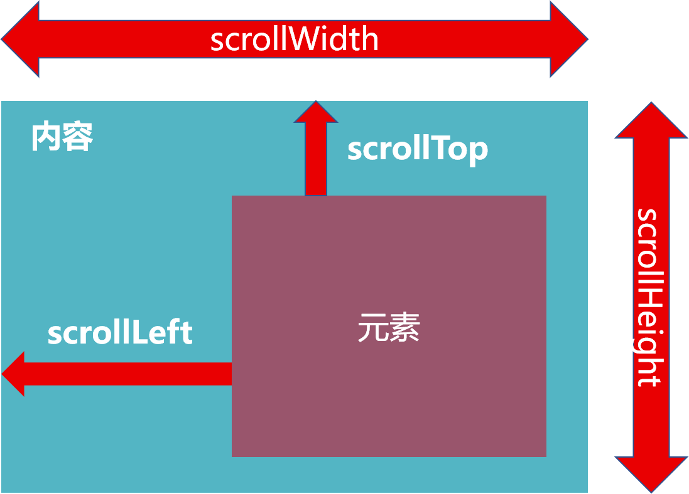

### 元素大小和位置

- scroll家族
- offset家族
- client家族

#### 1. scroll家族

使用scroll来检测页面滚动的距离

##### 1.1 

- 获取宽高：

​			获取元素的内容总宽高（不包含滚动条），返回 值不带单位

​			scrollWidth和scrollHeight

- 获取位置：

​			获取元素内容往左、往上滚动出届看不到的距离

​			**scrollLeft 和 scrollTop**

​			以上两个属性可<u>**修改**</u>

#### 2. offset家族

解决当滚动页面到特定位置时显示某些功能，但该位置在js代码中不应该是类似 '500' 的定值。

- 获取宽高：

  获取元素的自身宽高、包含元素自身设置的宽高、padding、border
  offsetWidth 、 offsetHeight

- 获取位置：
  获取元素距离自己**定位父级**元素的左、上距离
  offsetLeft 和 offsetTop 是<u>只读属性</u>

- offsetWidth 和 offsetHeight得到元素的（内容 + padding + border ）宽高
- offsetTop和offsetLeft得到的位置以 <u>带有定位的父级</u> 为准，若无则以 <u>文档左上角</u> 为准

#### 3. client家族

- 获取宽高：
  获取元素的可见部分宽高（不包含边框、滚动条等）
  clientWidth和clientHeight

- 获取位置：
  获取左边框和上边框宽度
  clientLeft和clientTop    注意：<u>只读属性</u>  使用极少！ （边框宽度）
