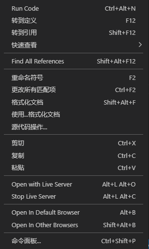
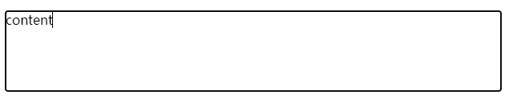

#### **1. rem适配移动端**

   核心：修改HTML文字大小，第一步是：

   ```css
html {
    size: 12px /*输入具体的像素大小*/
}
   ```

   在js中：

   ```javascript
document.documentElement.style.fontSize = rem + 'px'
   ```

   document.documentElement返回html元素

#### **2. VS Code 中使用 ESlint 和 prettier**

​		在VS Code中使用 ESlint 和 prettier 去解决代码中的语法和格式化问题。右键VS Code代码区，

选择”使用...格式化文档“，选择使用VS Code自带或者是插件来格式化代码。

​	VSCode 配置包括 VSCode 扩展配置是可以在团队成员间共享的，安装 npm 包并不是因为仅使用 VSCode 无法实现 Prettier + ESLint 的效果，而是因为 npm 包用于配合构建工具在开发环境运行时以及生产构建时抛出错误或提示，比如 Webpack 中的 eslint-loader。

##### 2.1  ESLint

​	ESLint最初是由[Nicholas C. Zakas](http://nczonline.net/) 于2013年6月创建的开源项目。它的目标是提供一个插件化的javascript代码检测工具。

​	"ESLint 主要用于语法检查，但也接管了部分代码格式化配置（并不是 ESLint 也用于格式化）。Prettier 永远只做格式化。这就存在一个问题，有些 ESLint 规则和 Prettier 规则之间存在冲突，解决这个问题的办法并不是简单的将冲突的配置同步，配置冲突往往是隐蔽的，你无法简单的通过眼睛识别所有冲突的配置，需要借助其他工具（npm 包）。"

##### 2.2 Prettier - Code formatter

​	[prettier](https://link.zhihu.com/?target=https%3A//prettier.io/docs/en/index.html) 是一个代码格式化插件。它并不关心你的语法是否正确，只关心你的代码格式，比如是否使用单引号，语句结尾是否使用分号等等。

​	如果安装了 ESlint-plugin-prettier，那么没必要再安装VS Code中的prettier插件

##### 容易遇到的问题

​	如果使用 prettier 格式化后，ESlint会报格式错误，需按照ESlint的格式要求作出修改，

#### 3.console.log 自定义样式

​	使用 ‘%’ + 小写字母 ‘c‘ 为输出内容自定义样式，在第二个参数设置想要添加的 css 样式

1. 

   ```javascript
   console.log('%cStop！！','-webkit-text-stroke: 2px black; color: red; font-size: 50px; font-weight: bold')
   ```

   

2. 

   ```javascript
   console.log('%cdev%cv2.5.6','padding: 3px; color: white; background: #023047', 'padding: 3px; color: white; background: #219EBC')
   ```

   

3. 如果要插入图片，可以给空字符增加base64编码的背景图来实现，但不支持通过设置宽高来控制大小，需要利用padding来撑开展示图片

4. 还可以给 console 封装和拓展方法

#### 4. 立即执行函数

​	代码格式：

```javascript
(function (){}())
```

​	函数举例：

```javascript
(function flexible (window, document) {
    // 代码content
}(window, document))
```

- 优点：main引进后无需调用即立即执行，不用担心函数命令冲突的问题

#### 5. 设置屏幕rem大小

```JavaScript
document.documentElement.style.fontsize = rem + 'px'
```

rem适配：1 rem = 75px

#### 6. var、let、const区别

​	抛开区别，三者的共同点是都可以声明变量。

```
区别一：
	var 具有变量提升的机制，且与let相比，var存在块级作用域；
	let和const没有变量提升机制。
区别二：
	var可以多次声明同一个变量，并且后者覆盖前者；
	let和const不可多次声明同一个变量，多次声明报错，返回Uncaught SyntaxError。
区别三：
	var、let声明的变量可以再次赋值；
	const声明常量，声明的值的指向内存不变
```


#### 7. 递归函数

​	调用函数自身的函数称为递归函数

- setTimeout()函数结合递归函数 可以实现与 setInterval() 一样的功能

- setTimeout()用于在指定毫秒数后再调用函数或者计算表达式

  ```js
  setTimeout(code,millisec)
  ```

- setInterval()方法用于按照指定的周期来循环调用函数或者计算表达式，直到clearInterval()被调用或者窗口关闭，由setInterval()返回的ID值可用作clearInterval()方法的参数

- 区别：setTimeout()方法只运行一次，而setInterval()是循环执行的

#### 8. 三个user开头的css属性

##### 01-user-select

```css
body {
    -webkit-user-select: none;
    -mod-user-select: none;
    -ms-user-select: none;
    user-select: none;
}
```

在body上全局设置，使整个页面的文字内容无法通过长按呼起选择栏进行复制选取等操作的Tips。

special parts:

```css
user-select: all
```

all 属性值可以让元素及其子元素同时选中。例：

```css
section{
    user-select: all;
}
```

`<section>`自身及其子元素会被全选

这种选中的样式的添加和移除都是浏览器原生的行为。user-select兼容性较好，Safari浏览器需加入-webkit 私有前缀

##### 02 -user-drag

```css
user-drag: auto | none | element
```

- element 属性值为Safari Only！

- 三个属性值默认为auto，表现为图片和文字可以拖拽，其他元素不可以。

- element可以让整个元素都可以拖拽，Safari独有，但实用性不高

- 例：

  ```html
  
  ```

  ```css
  .no-drag {
      -webkit-user-drag: none;
  }
  ```

  使插入的img无法拖拽。

##### 03 -user-modify

用户输入行为属性user-modify，此css属性可以让普通的<div>元素像<input>一样可以输入：

```html
<p class="border read-write"></p>
```

```css
.read-write {
    -webkit-user-modify: read-write;
    min-height: 100px;
    border: 1px solid #efefef;
}
```



此实现方式跟<textarea>相比，优势在于：天然高度自适应，只需要设置min-height最小高度，就可以自动高度自适应。

此外，read-write -支持富文本，这往往不需要，更多的时候希望输入的只是纯文本，则应更改属性值为 read-write-plaintext-only

#### 9. 与滚动有关的CSS属性

##### 01 - scroll Snap

CSS Scroll Snap 是CSS中的一个独立的模块，可以使元素停止滚动时有平滑吸附的效果。容易实现类似Swiper这种交互。可以在移动端随意使用。

| 作用在滚动容器上 | 作用在定位子项上  |
| :--------------: | :---------------: |
| scroll-snap-type | scroll-snap-align |
| scroll-snap-stop |   scroll-margin   |
|  scroll-padding  |                   |


##### 02 - scroll-behavior

该属性可以让滚动容器出现锚点定位，或者JS设置 serollLeft/scrollTop的滚动距离时表现为平滑滚动。在需要平滑滚动的滚动容器元素上写上：

```css
scroll-behavior: smooth
```

即可。演示案例如下：

```html
<div class="box">
    <div class="list"><input id="one" readonly>1</div>
    <div class="list"><input id="two" readonly>2</div>
    <div class="list"><input id="three" readonly>3</div>
    <div class="list"><input id="four" readonly>4</div>
</div>
<div class="link">
    <label class="click" for="one">1</label>
    <label class="click" for="two">2</label>
    <label class="click" for="three">3</label>
    <label class="click" for="four">4</label>
</div>
```

核心CSS如下：

```css
.box {
    width: 20em;
    height: 10em;
    scroll-behavior: smooth;
    overflow: hidden;
}
.list {
    height: 100%;
    background: #ddd;
    text-align: center;
    position: relative;
}
.list > input {
    position: absolute;
    top: 0;
    height: 100%;
    width: 1px;
    border: 0;
    padding: 0;
    margin: 0;
    clip: rect(0 0 0 0);
}
```


##### 03 - overscroll-behavior

滚动嵌套，该属性可以让子元素滚动嵌套时父元素不触发滚动。

```css
overscroll-behavior： auto; /* 默认值 */
overscroll-behavior：contain;
overscroll-behavior：none;

/* 两个属性值，分别表示x方向和y方向 */
overscroll-behavior：auto contain;
```

##### 04 - overflow-anchor

overflow-anchor让内容动态append时自动调整滚动高度，保持当前元素视区不变

```css
overflow-anchor: auto | none;
```

##### 05 - scrollbar-width

滚动条宽度

```css
scrollbar-width: auto | thin | none;
```

- auto 为默认的尺寸，在windows系统下是17px；
- thin 为窄滚动条，在windows系统下是8px；
- none 为无滚动条，宽度为0，但内容依然可以滚动；
- 此属性只在windows下的Firefox浏览器下有效。

##### 06 scrollbar-color

滚动条颜色

```css
scrollbar-color: auto | 滑杆颜色 轨道颜色;
```

```css
.scroll-thin {
    scrollbar-width: thin;
    scrollbar-color: blue red;
}
```

兼容性同scrollbar-width。但Chrome和Safari浏览器有私有的 <u>::webkit-scrolbar</u> 伪元素属性

```css
.scroll::-webkit-scrollbar {
    width: 8px;
    height: 8px;
}
.scroll::-webkit-scrollbar-thunb {
    background-color: #bbb;
}
.scroll::-webkit-scrollbar-track{
    background-color: #ddd;
}
```

##### 07 - scrollbar-gutter

滚动条沟槽，作用是让windows下，滚动条出现的时候，布局稳定，页面不晃动

##### 08 - -webkit-overflow-scrolling

Safari私有，让IOS设备在滚动时有回弹效果。

- 注意，IOS13后，所有可滚动的框架，或者设置overflow滚动的元素默认都是弹性效果

- ```
  -webkit-overflow-scrolling:touch
  ```

  

#### 10. node.js 工具 version/semver规范

[Semantic Version](https://link.jianshu.com/?t=http://semver.org/)是当下被大多数软件/库使用的一套版本命名规范。

[Semver](https://link.jianshu.com/?t=https://github.com/npm/node-semver)是一个专门分析Semantic Version（语义化版本）的工具，“semver”其实就是这两个单词的缩写。Npm使用了该工具来处理版本相关的工作。

semver可以作为一个node模块，同时也可以作为一个命令行工具。功能包括：

- 比较两个版本号的大小
- 验证某个版本号是否合法
- 提取版本号，例如从“=v1.2.1”体取出"1.2.1"
- 分析版本号是否属于某个范围或符合一系列条件
- etc
  + ^1.2.3  表示第一个数字保持不变，后面两个数字保持最新
  + ~1.2.3 表示前面两个版本号不变，第三个保持最新


#### 11. webpack打包 重复依赖的问题

假设有三个子项目，都依赖了element ui，子项目可以独立运行， 主项目依赖三个子项目。

主项目通过webpack打包时文件较大，则应该是element ui被重复依赖了三次。应实现主项目打包时只引入一份element ui。

解决方案有几个：

1. 引用子项目的时候，不要引用打包后的文件（通常为 `import sub1 from 'sub1';`)，而是引用入口文件，比如 `import sub1 from 'sub1/src'`;
2. 子项目 build 的时候使用 chunk 拆分成业务逻辑和依赖，即常见的 app.js 和 vendor.js
3. 子项目 build 不同版本，作为依赖时，将依赖使用 `externals` 避免打包

#### 12. 键值对

键值对（“key=value”）

#### 13. localStorage 

1. 存储复杂数据类型
   本地存储只能存储字符串，无法存储复杂数据类型。需要将复杂数据类型转换成JSON字符串，再存储到本地
2. JSON.stringify (复杂数据类型)
   将复杂数据转换成 JSON字符串， <u>存储</u> 于本地存储中
3. JSON.parse (JSON字符串)
   将JSON字符串转换成对象  <u>取出</u> 时候使用

#### 14. 自定义属性

由程序员自己添加的属性，在DOM对象中无法获取，无法使用，无法操作

- getAttribute('属性名')   // 获取自定义属性
- setAttribute('属性名', '属性值')    // 设置自定义属性
- removeAttribute('属性名')   // 删除自定义属性

data-自定义属性:
	html5推出专门的data-自定义属性， 

- 在标签上一律以data-开头
- 在DOM对象上一律以dataset对象方式获取

#### 15. CSS specificity -CSS权重

id选择器 > class类选择器 > type通配符选择器 > *

类选择器 = 伪类选择器

class =  attribute

加号`+`与波浪号`~`和大于号`>`: 

- +,  A + B : 选择紧邻A标签后的B标签，且A和B必须拥有相同的父元素，仅为一个标签；
- ~ , A ~ B :  选择A标签后出现的所有B标签，B标签不必紧随A标签，两种元素必须拥有相同的父元素，可以有多个；
- `>`, A > B : 选择A元素中的B元素，其中B元素是A元素的第一代。


#### 16.  箭头函数

箭头函数为es6中的全新表示法，下列是一个最简单的箭头函数：

```javascript
let fn = a => a
var m = prompt()
alert(fn(m))
```

对比es5

```javascript
let fn=function(a){
    return a;
}
var m = prompt()
alert(fn(m))
```

如果语句为多条，则不可以省略{}和return

```javascript
let fn = a=>{
    var b = 0;
    console.log(a,b)
}
fn(10)
```

有两点需注意：

1. 当传递单个参数时，不需要加括号()

   ```javascript
   var fn = a => a
   ```

   当传递多个值时需要加括号

   ```javascript
   var fn = (a,b)=>a+b
   ```

2. 当省略{}和return时，如果返回的内容是一个对象，对象需要用括号()括起来，否则结果是undefined

   ```javascript
   var fn = a =>({a:'你好'})
   console.log(fn())
   ```

   

#### 17. button 按钮冒泡

当页面上的button 被点击产生了一个事件，会对该事件进行冒泡操作：

```html
<div>
    <button>
        按钮
    </button>
</div>
```

```js
div.onclick = function() {
    console.log('div')
}
button.onclick = function() {
    console.log('button')
}
```

当点击button按钮后，控制台输出button的同时会冒泡，输出div

#### 18. 设置a标签新页面打开

(1)  给a标签添加一个属性：target="_blank";

(2) 在head标签中加入：

<base target="_blank" />

#### 19. 面试知识

**JS中的提升**

包括变量的提升和函数的提升，只提升声明

函数中的提升，会提升到当前函数的最前面。

**html中的全选和反选**

如何实现；every、foreach、“手写一个every”

**es6新语法**

every、sum、reduce。

让对象的属性不变：冻结、Object.freeze、Object.defineProperty

**内存泄露。内存的生命周期**

JS垃圾回收机制、创建、挂载、渲染、修改、销毁

**字符串翻转**

sort用于数组的排序，reverse用于数组的翻转。

**Promise 、generator 、async await**

解释各个方法产生的原因、"回调地狱"

**HTTP状态码**

301和302的区别


#### 20. 作用域和作用域链

**什么是作用域？**

简单来说，在一定的空间里可以对数据进行读写操作，这个空间就是数据的作用域。
 JS中最常见的就是变量的作用域。
 变量的作用域分为两种：全局变量和局部变量。
 1、全局作用域： 最外层函数定义的变量拥有全局作用域，即对任何内部函数来说，都是可以访问的；
 2、局部作用域： 局部作用域一般只在固定的代码片段内可访问到，而对于函数外部是无法访问的，最常见的例如函数内部。

**顺便提一下，JS是没有块级作用域的。**

这意味着在块语句中定义的变量，实际是在函数中创建的，而不是语句中。
 函数可以模仿块级作用域。

```jsx
(function(){
//这里是块级作用域
})();
```

**什么是是作用域链？**

当代码在一个环境中执行时，会创建变量对象的一个作用域链。
 由子级作用域返回父级作用域中寻找变量，就叫做作用域链。

作用域链中的下一个变量对象来自包含环境，也叫外部环境。而再下一个变量对象则来自下一个包含环境，一直延续到全局执行环境。全局执行环境的变量对象始终都是作用域链中的最后一个对象。
 作用域链前端始终都是当前执行的代码所在环境的变量对象，如果环境是函数，则将其活动对象作为变量对象。

**作用域链的用途是什么呢？**

是保证执行环境有权访问的所有变量和函数的有序访问。

**如何延长作用域链？**

既然是个链，能不能延长呢？
 答案当然是可以。
 延长作用域链：
 执行环境的类型只有两种，全局和局部（函数）。但是有些语句可以在作用域链的前端临时增加一个变量对象，该变量对象会在代码执行后被移除。
 具体来说就是执行这两个语句时，作用域链都会得到加强。
 1、try - catch 语句的catch块；会创建一个新的变量对象，包含的是被抛出的错误对象的声明。
 2、with 语句。with 语句会将指定的对象添加到作用域链中。

