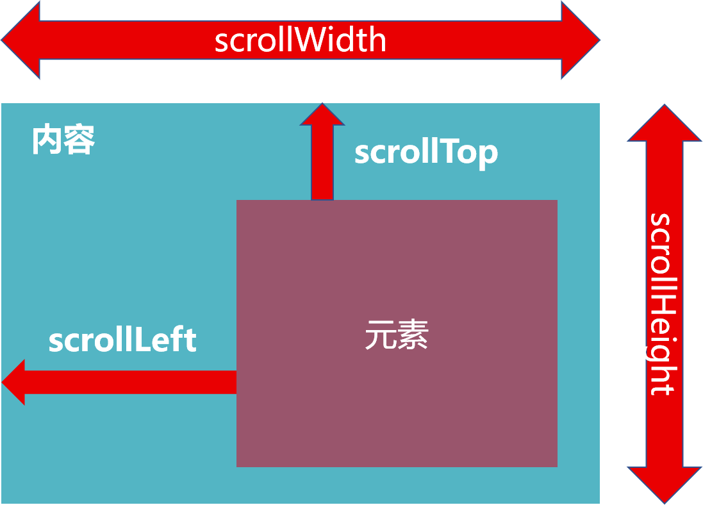

# html

#### 1. rem适配移动端

-    核心：修改HTML文字大小，第一步是：


   ```css
 html {
    size: 12px /*输入具体的像素大小*/
}
   ```

-    在js中：


   ```javascript
document.documentElement.style.fontSize = rem + 'px'
   ```

   `document.documentElement`返回html元素


#### 2. ESLint 与 Prettier

1. **ESLint**
   ESLint最初是由[Nicholas C. Zakas](http://nczonline.net/) 于2013年6月创建的**开源项目**。它的目标是提供一个**插件化的javascript代码检测工具**。
   "ESLint 主要用于语法检查，但也接管了部分代码格式化配置（并不是 ESLint 也用于格式化）。Prettier 永远只做格式化。
2.  **Prettier - Code formatter**
   prettier 是一个**代码格式化插件**。它并**不关心你的语法是否正确**，只关心你的**代码格式**，比如是否使用单引号，语句结尾是否使用分号等等。如果安装了 ESlint-plugin-prettier，那么没必要再安装VS Code中的prettier插件


#### 3. **html中的全选和反选**

如何实现；every、foreach、“手写一个every”


#### 4. 元素的大小和位置

- scroll家族
- offset家族
- client家族




#### 5. 移动端适配

`meta`标签设置视口：`maximum=scale=1.0, minimum-scale=1.0, user-scalable=no`。


#### 6. px单位转化

设置单位：px转为rem或vw（推荐）。 1vw-3.75px，1rem-37.5rem。使用Webpack或者Vite来完成单位转化：
Vite/Webpack  -> postcss工具 -> plugins -> postcss-px-to-viewport。
设计稿宽度375： viewportWidth：375


#### 7. 什么是语义化标签

语义化标签：就是让标签有自己的含义，利用本身传达它所包含内容的一些信息，使浏览器和搜索引擎直观的认识标签和属性的用途和作用。

**优点：**

1. 易读性和维护性更好；
2. SEO成分更好，蜘蛛抓取更好；
3. IE8不兼容HTML5标签，可通过`html5shiv.js`处理

**SEO中常见的语义化标签**：

- H标签
- strong标签的使用
- title 网站SEO标题
- `<meata name="description" content="网站描述"`
- `<meta name="keywords" content="网站关键字">`
- `<a href="链接地址" title="链接说明">`
- ``
- `<div id="copyright">版权部分加上网站名称与链接</div>`

**html5**新增语义化标签-节元素标签，包括header、footer、nav、article、section以及aside等结构相关的结构元素标签。


#### 8. HTML块级元素及行内元素

HTML元素根据其表现形式可分为2种：

- 块级元素
- 行内元素


##### 1. 块级元素

块级元素在浏览器中占据整行，并排斥其它元素与其位于同一行。换句话说其宽度为100%。常见的块级元素如下表：

| 块级元素 | 说明                  |
| -------- | --------------------- |
| div      | 基础块级元素          |
| p        | 段落                  |
| h1-h6    | 1~6级标题（默认加粗） |
| br       | 换行                  |
| ol       | 有序列表              |
| ul       | 无序列表              |

##### 2.行内元素

行内元素又称内联元素（inline block）。在浏览器中与其它行内元素共占一行，当多个元素的总宽度大于浏览器的宽度时，才会显示换行。常见行内元素如下表：

| 行内元素 | 说明                                         |
| -------- | -------------------------------------------- |
| a        | 超链接                                       |
| span     | 短语内容的通用行内容器，并没有任何特殊语义。 |
| strong   | 加粗，强调                                   |
| b        | 加粗，不强调                                 |
| em       | 斜体，强调                                   |
| i        | 斜体，不强调                                 |
| img      | 图片                                         |
| input    | 输入框                                       |
| select   | 下拉列表                                     |

##### 3. 元素的嵌套

- 块元素可以嵌套块元素
- 块元素可以嵌套行内元素
- 行内元素可以嵌套行内元素（建议）
- 行内元素可以嵌套块元素（不推荐，不符合开发规范， 并导致行内元素独占一行）


#### 9. href 与 src 的区别

**href：**Hypertext Reference

最常见使用href属性的元素是：link 和 a。

href属性是超链接，会建立与对应资源的通道，不进行展示，且不会阻塞html  document的渲染


**src：**Source

使用src 属性的元素是：img、style、script、input和iframe。

src属性引用的资源会成为当前文档的一部分，且src属性在引用时会下载目标资源并且反映到当前document上，浏览器在遇到此属性时会暂停其它资源的下载和处理直到属性指向的资源下载编译和执行完后才会进行下一步。

src属性是页面资源，会下载资源并替代当前元素，然后嵌入到文档中。未成功加载时会暂停页面解析，但不暂停页面渲染。

```html

<a href="image.png">链接</a>
```


# css

#### 1. 伪元素与伪类的区别

```
:是伪类 ::是伪元素
```

面试题：::before和::after中双冒号和单冒号 有什么区别？解释一下这两个伪元素的作用？

:是伪类， ::是伪元素。

作用1：清除浮动

```css
ul::after {
    content: '';
    display: block;
    clear: both;
}
```

作用2：样式布局


#### 2. 圣杯布局的方式


#### 3. CSS specificity -权重 


##### 01- 继承和级联

CSS中的优先级分为两大类，继承和级联，其中<u>继承的CSS优先级一定位于最底层</u>。

例1：

```css
.text { color: orange;}
div [class] { color: red;}
div::first-line { color: blue;} /* 蓝色*/
div { color: green !important;}
```

```html
<div class="text">文字</div>
```

对比的不是选择器的优先级（权重），而是继承与否。color属性是一个可继承属性，::first-line设置的样式优先级大于任意的继承样式。DOM层级越深的元素所继承的CSS优先级越高。

```html
<!DOCTYPE html>
<html>
<body>
    <p>文字颜色</p>
</body>
</html>
```

```css
:root {
    color: red;
}
body {
    color: green;
}
```


##### 02- 关于级联

CSS中一层一层的优先级规则可以看成是级联。

日常开发代码 > @layer开发代码 > 插件注入代码 > 浏览器内置代码

##### 03- @layer 规则

将希望低优先级的CSS代码放在@layer规则中，不用担心选择器优先级过高的问题

例：

```css
@layer {
    .container .some-button { height: 30px;}
    :any-link { color: blue;}
    :any-link:hover { color: darkblue;}
}

/* 优先级大于@layer，无需在意选择器权重 */
.some-button { height: 40px;}
a { color: deepskyblue;}
a:hover { color: skyblue;}
```


##### 04- 了解 !important

任何CSS声明在后面设置了 !important之后，其级联层级就会跃升。

1. 层级跃阶
   级联层级提升；
2. 逆向跃阶
   原本级联水平高的CSS声明应用了!important后，其优先级反而变低；而原本级联水平低的CSS声明应用了!important后，CSS计算的优先级变高。

##### 05- 每一级中的优先级

1. 内联

   ```css
   <p style="color:aliceblue">颜色</p>
   ```

2. ID选择器

   ```css
   #some-id { color: aqua;}
   ```

3. 类、伪类、属性选择器

   ```css
   .some-id,
   [some-attr],
   :first-child { color: beige}
   ```

4. 标签选择器

   ```css
   some-tag { color: cadeblue;}
   ```

5. 通配符选择器、功能伪类

   ```css
   *, :not(), :is(), :where(any-selector) {
       color: darkcyan
   }
   ```

以上CSS选择器，权重从上往下排序。


`id`选择器 >` class`类选择器 > `type`通配符选择器 > `*`

类选择器 = 伪类选择器

class =  attribute

加号`+`与波浪号`~`和大于号`>`: 

- +,  A + B : 选择紧邻A标签后的B标签，且A和B必须拥有相同的父元素，仅为一个标签；
- ~ , A ~ B :  选择A标签后出现的所有B标签，B标签不必紧随A标签，两种元素必须拥有相同的父元素，可以有多个；
- `>`, A > B : 选择A元素中的B元素，其中B元素是A元素的第一代。


#### 4. 性能优化的方式


#### 5. 三个user开头的css属性

**01-user-select**

```css
body {
    -webkit-user-select: none;
    -mod-user-select: none;
    -ms-user-select: none;
    user-select: none;
}
```

在body上全局设置，使整个页面的文字内容无法通过长按呼起选择栏进行复制选取等操作的Tips。

special parts:

```css
user-select: all
```

all 属性值可以让元素及其子元素同时选中。例：

```css
section{
    user-select: all;
}
```

`<section>`自身及其子元素会被全选

这种选中的样式的添加和移除都是浏览器原生的行为。user-select兼容性较好，Safari浏览器需加入-webkit 私有前缀

**02-user-drag**

```css
user-drag: auto | none | element
```

- element 属性值为Safari Only！

- 三个属性值默认为auto，表现为图片和文字可以拖拽，其他元素不可以。

- element可以让整个元素都可以拖拽，Safari独有，但实用性不高

- 例：

  ```html
  
  ```

  ```css
  .no-drag {
      -webkit-user-drag: none;
  }
  ```

  使插入的img无法拖拽。

**03-user-modify**

用户输入行为属性`user-modify`，此css属性可以让普通的`<div>`元素像`<input>`一样可以输入：

```html
<p class="border read-write"></p>
```

```css
.read-write {
    -webkit-user-modify: read-write;
    min-height: 100px;
    border: 1px solid #efefef;
}
```

此实现方式跟`<textarea>`相比，优势在于：天然高度自适应，只需要设置min-height最小高度，就可以自动高度自适应。

此外，read-write -支持富文本，这往往不需要，更多的时候希望输入的只是纯文本，则应更改属性值为 `read-write-plaintext-only`


#### 6. 与滚动有关的CSS属性

**01 - scroll Snap**

CSS Scroll Snap 是CSS中的一个独立的模块，可以使元素停止滚动时有平滑吸附的效果。容易实现类似Swiper这种交互。可以在移动端随意使用。

| 作用在滚动容器上 | 作用在定位子项上  |
| :--------------: | :---------------: |
| scroll-snap-type | scroll-snap-align |
| scroll-snap-stop |   scroll-margin   |
|  scroll-padding  |                   |


**02 - scroll-behavior**

该属性可以让滚动容器出现锚点定位，或者JS设置 serollLeft/scrollTop的滚动距离时表现为平滑滚动。在需要平滑滚动的滚动容器元素上写上：

```css
scroll-behavior: smooth
```

即可。演示案例如下：

```html
<div class="box">
    <div class="list"><input id="one" readonly>1</div>
    <div class="list"><input id="two" readonly>2</div>
    <div class="list"><input id="three" readonly>3</div>
    <div class="list"><input id="four" readonly>4</div>
</div>
<div class="link">
    <label class="click" for="one">1</label>
    <label class="click" for="two">2</label>
    <label class="click" for="three">3</label>
    <label class="click" for="four">4</label>
</div>
```

核心CSS如下：

```css
.box {
    width: 20em;
    height: 10em;
    scroll-behavior: smooth;
    overflow: hidden;
}
.list {
    height: 100%;
    background: #ddd;
    text-align: center;
    position: relative;
}
.list > input {
    position: absolute;
    top: 0;
    height: 100%;
    width: 1px;
    border: 0;
    padding: 0;
    margin: 0;
    clip: rect(0 0 0 0);
}
```


**03 - overscroll-behavior**

滚动嵌套，该属性可以让子元素滚动嵌套时父元素不触发滚动。

```css
overscroll-behavior： auto; /* 默认值 */
overscroll-behavior：contain;
overscroll-behavior：none;

/* 两个属性值，分别表示x方向和y方向 */
overscroll-behavior：auto contain;
```


**04 - overflow-anchor**

overflow-anchor让内容动态append时自动调整滚动高度，保持当前元素视区不变

```css
overflow-anchor: auto | none;
```


**05 - scrollbar-width**

滚动条宽度

```css
scrollbar-width: auto | thin | none;
```

- auto 为默认的尺寸，在windows系统下是17px；
- thin 为窄滚动条，在windows系统下是8px；
- none 为无滚动条，宽度为0，但内容依然可以滚动；
- 此属性只在windows下的Firefox浏览器下有效。


**06 scrollbar-color**

滚动条颜色

```css
scrollbar-color: auto | 滑杆颜色 轨道颜色;
```

```css
.scroll-thin {
    scrollbar-width: thin;
    scrollbar-color: blue red;
}
```

兼容性同scrollbar-width。但Chrome和Safari浏览器有私有的 <u>::webkit-scrolbar</u> 伪元素属性

```css
.scroll::-webkit-scrollbar {
    width: 8px;
    height: 8px;
}
.scroll::-webkit-scrollbar-thunb {
    background-color: #bbb;
}
.scroll::-webkit-scrollbar-track{
    background-color: #ddd;
}
```


**07 - scrollbar-gutter**

滚动条沟槽，作用是让windows下，滚动条出现的时候，布局稳定，页面不晃动


**08 - -webkit-overflow-scrolling**

Safari私有，让IOS设备在滚动时有回弹效果。

- 注意，IOS13后，所有可滚动的框架，或者设置overflow滚动的元素默认都是弹性效果

- ```
  -webkit-overflow-scrolling:touch
  ```


#### 7. CSS设置a标签新页面打开

(1)  给a标签添加一个属性：target="_blank";

(2) 在head标签中加入：


#### 8. CSS设置超出文本显示省略号相关

```css
.ellipsis-text {
    overflow:hidden;
    word-wrap: normal;
    white-space: nowrap;
    text-overflow:ellipsis;
}
```

`overflow:hidden` ：隐藏从容器溢出到周围区域的内容；

`word-wrap `：被`overflow-wrap`替代。设置浏览器是否应在不可中断的字符串中插入换行符，以防止文本溢出其行框。`normal`值：行只能在正常的单词断点（如两个单词之间的空格）处断开。

`white-space` ：设置如何处理元素中的空白，属性值nowrap，内容以一行展现，并超出区域。

`text-overflow`：用于确定如何提示用户存在隐藏的溢出内容。其形式可以是裁剪、显示一个省略号（“`…`”）或显示一个自定义字符串。属性值：`ellipsis`，隐藏溢出内容，并以省略号（“`…`”）显示。


```css
.ellipsis-text {
    overflow: hidden;
    overwflow-wrap: normal;
    white-space: nowrap;
    text-overflow: ellipsis;
}
```


#### 9. CSS设置文档滚动

```css
.box {
    height: 100vh;
    overflow-y: auto;
    box-sizing: border-box;
}
```

如果div元素不设置高度和overflow-y为auto，则当前page下的滚动为window滚动


#### 10. background 属性

background 属性指定多个属性，`background: background-image background-position background-size;`

```css
.box {
    background: url(./xxx.png) 0 0 / 100% 100%
}
```


#### 11. linear-gradient

linear-gradient使用`background-image`属性而不是`background`或`background-color`：

```css
background-image: linear-gradient(90deg, #fa8c1d, #facf3f);
```


#### 12. 通过padding-top或padding-bottom实现等比例缩放响应式图片

实现原理：让子元素宽高比例与父元素相同。当padding的值为百分比时，是根据当前元素的父元素的宽度来计算的。


#### 13. 无衬线字体族的全局`font-family`最佳设置

`font-family`设置最佳实践

```css
@font-face {
  font-family: Emoji;
  src: local("Apple Color Emojiji"), local("Segoe UI Emoji"), local("Segoe UI Symbol"), local("Noto Color Emoji");
  unicode-range: U+1F000-1F644, U+203C-3299;
}
body {
  font-family: system-ui, —apple-system, Segoe UI, Rototo, Emoji, Helvetica, Arial, sans-serif;
}
```

其他字体族字体设置

```css
font-serif {
  font-family: Georgia, Cambria, "Times New Roman", Times, serif;
}

```

等宽字体

```css
.font-mono {
  font-family: Menlo, Monaco, Consolas, "Liberation Mono", "Courier New", monospace;
}
```


# JavaScript

#### 1. 如何上传文件到后端服务器


#### 2. JS运行机制- EventLoop 事件循环


#### 3. HTTP long-polling 长轮询


#### 4. JS 任务队列

任务队列放的是回调函数而不是异步代码，后者放在数组内

关联文章：https://juejin.cn/post/6993223519609815053


#### 5. json.parse 与 json.stringify 在深拷贝有什么区别


#### 6. js 深拷贝与浅拷贝


#### 7. 项目中登录和注册的方法与原理（token）


#### 8. 前端能否判断token是否过期？

不能，只有server端才能验证和判断


#### 9. es6中声明变量的六种方法

1. var
2. function
3. let
4. const
5. import
6. class
7. 

#### 10. JavaScript中的数据类型

1. 值类型（基本类型）

   - undefined

   - Boolean

   - null

   - String

   - Number

   - BigInt
   - Symbol

2. 引用数据类型（对象类型）

   - Object
   - Array
   - Function

3. 特殊

   - 正则（RegExp）
   - 日期（Date）


#### 11. var、let、const的区别

抛开区别，三者的共同点是都可以声明变量。

```
区别一：
	var 具有变量提升的机制，且与let相比，var存在块级作用域；
	let和const没有变量提升机制。
区别二：
	var可以多次声明同一个变量，并且后者覆盖前者；
	let和const不可多次声明同一个变量，多次声明报错，返回Uncaught SyntaxError。
区别三：
	var、let声明的变量可以再次赋值；
	const声明常量，声明的值的指向内存不变
```


#### 12. 递归函数 setTimeout 与 setInterval

​	调用函数自身的函数称为递归函数

- `setTimeout()`函数结合递归函数 可以实现与 `setInterval()` 一样的功能

- `setTimeout()`用于在指定毫秒数后再调用函数或者计算表达式

  ```js
  setTimeout(code,millisec)
  ```

- `setInterval()`方法用于按照指定的周期来循环调用函数或者计算表达式，直到`clearInterval()`被调用或者窗口关闭，由setInterval()返回的ID值可用作clearInterval()方法的参数

- 区别：`setTimeout()`方法只运行一次，而`setInterval()`是循环执行的


#### 13. localStorage

1. 存储复杂数据类型
   本地存储只能存储字符串，无法存储复杂数据类型。需要将复杂数据类型转换成JSON字符串，再存储到本地
2. JSON.stringify (复杂数据类型)
   将复杂数据转换成 JSON字符串， <u>存储</u> 于本地存储中
3. JSON.parse (JSON字符串)
   将JSON字符串转换成对象  <u>取出</u> 时候使用


#### 14. 自定义属性

由程序员自己添加的属性，在DOM对象中无法获取，无法使用，无法操作

- getAttribute('属性名')   // 获取自定义属性
- setAttribute('属性名', '属性值')    // 设置自定义属性
- removeAttribute('属性名')   // 删除自定义属性

data-自定义属性:
	html5推出专门的data-自定义属性， 

- 在标签上一律以data-开头
- 在DOM对象上一律以dataset对象方式获取


#### 15. JS中的提升

包括变量的提升和函数的提升，只提升声明

函数中的提升，会提升到当前函数的最前面。


#### 16. es6新语法

every、sum、reduce。

让对象的属性不变：冻结、Object.freeze、Object.defineProperty


#### 17. **内存泄露。内存的生命周期**

JS垃圾回收机制、创建、挂载、渲染、修改、销毁


#### **18. 字符串翻转**

`sort()` 用于数组的排序，`reverse()`用于数组的翻转，join()，slice()，replace()

```js
str.split('').reverse().join('')
```


#### 19. Promise 、generator 、async await

解释各个方法产生的原因、"回调地狱"


#### 20. HTTP状态码

301和302的区别。


#### 21. 作用域和作用域链

**什么是作用域？**

简单来说，在一定的空间里可以对数据进行读写操作，这个空间就是数据的作用域。
 JS中最常见的就是变量的作用域。
 变量的作用域分为两种：全局变量和局部变量。
 1、全局作用域： 最外层函数定义的变量拥有全局作用域，即对任何内部函数来说，都是可以访问的；
 2、局部作用域： 局部作用域一般只在固定的代码片段内可访问到，而对于函数外部是无法访问的，最常见的例如函数内部。

**顺便提一下，JS是没有块级作用域的。**

这意味着在块语句中定义的变量，实际是在函数中创建的，而不是语句中。
 函数可以模仿块级作用域。

```jsx
(function(){
//这里是块级作用域
})();
```

**什么是是作用域链？**

当代码在一个环境中执行时，会创建变量对象的一个作用域链。
 由子级作用域返回父级作用域中寻找变量，就叫做作用域链。

作用域链中的下一个变量对象来自包含环境，也叫外部环境。而再下一个变量对象则来自下一个包含环境，一直延续到全局执行环境。全局执行环境的变量对象始终都是作用域链中的最后一个对象。
 作用域链前端始终都是当前执行的代码所在环境的变量对象，如果环境是函数，则将其活动对象作为变量对象。

**作用域链的用途是什么呢？**

是保证执行环境有权访问的所有变量和函数的有序访问。

**如何延长作用域链？**

既然是个链，能不能延长呢？
 答案当然是可以。
 延长作用域链：
 执行环境的类型只有两种，全局和局部（函数）。但是有些语句可以在作用域链的前端临时增加一个变量对象，该变量对象会在代码执行后被移除。
 具体来说就是执行这两个语句时，作用域链都会得到加强。
 1、try - catch 语句的catch块；会创建一个新的变量对象，包含的是被抛出的错误对象的声明。
 2、with 语句。with 语句会将指定的对象添加到作用域链中。


#### 22. 数组索引匹配

```js
const values = []
let currentValue = 0

let currentIndex = values.length - 1

for (let i = 0; i < values.length; i++) {
    const value = values[i]
    if (value > currentIndex) {
        currentIndex= i - 1
        break
    }
}
```


#### 23.JS 随机生成0到num的随机数

```js
Math.floor(Math.random() * num )
```


#### 24. WeakMap() 与 Map()

弱引用与强引用，强引用中，当被引用的对象值为`null`时，强引用无法被销毁。使用WeakMap()的前提，其key必须是一个对象。


#### 25. 创建原型对象的三种方法

```js
function Person(name, age, height) {}
function Student() {}

// 不推荐
let p = new Person()
Student.prototype = p

// 1. 
let obj = {}
obj.__proto__ = Person.prototype
Object.setPrototypeOf(obj, Person.prototype)
Student.prototype = obj

// 2. 
function F() {}
F.prototype = Person.prototype
Student.prototype = new F()

// 3.
let obj = Object.create(Person.prototype)
Student.protype = obj

// 真实开发进行封装
// 寄生式函数
function inherit(Subtype, Supertype) {
    Subtype.prototype = Object.create(Supertype.prototype)
    Object.defineProperty(Subtype.prototype, "constructor", {
        enumerable: false,
        configurable:true,
        writable: true,
        value: Subtype
    })
}
inherit(Student, Person)
// 若Object.create有兼容性问题，则采用以下方法（不存在兼容性问题） 方法二 封装
function createObject(o) { // 创建对象的过程
    function F() = {}
    F.prototype = o
    return new F()
}
```

显示原型中一般都有`constructor`

原型式继承函数 -- 最终目的：student对象的原型指向了person对象；

-- for in 遍历的是所有原型上的内容

-- instanceof

- 用于检测构造函数的prototype，是否出现在某个实例对象的原型链上


#### 26. Storage

```js
// Storage常用方法
localStorage.setItem(key, value)
localStorage.getItem(key)
localStorage.removeItem(key)
localStorage.clear()
```

**注意：**storage本身不能够直接存储对象类型。对象转成字符串：`[Object, Object]`


#### 27. 深拷贝

1. 深拷贝的思路
2. 深拷贝的方式（手写）
3. Lodash库


#### 28. 遍历对象的方式

- for...in
- Object.keys()
- Object.getOwnPropertyNames()
- Object.getOwnPropertySymbols()
- Reflect.ownKeys()

首先，对象的属性划分如下：

1. 原型属性
2. 对象自身可枚举属性
3. 对象自身不可枚举属性
4. Symbol属性

```js
// 与原型属性
const obj = Object.create({
    bar: 'bar'
})
// 对象自身可枚举属性
obj.foo = 'foo'
// 对象自身不可枚举属性
Object.defineProperty(obj, "name", {
    enumrable: false,
    value: 'kingx'
})
// Symbol属性
obj[Symbol('age')] = 'age'
```


#### 29. 逻辑运算符 || 和 &&

逻辑或 **||** 和逻辑与 **&&**

总结：

1. 只要 || 前面为 false，无论 || 后面是true还是 false，结果都返回 || 后面的值。
2. 只要 || 前面为 true，无论 || 后面是true还是 false，结果都返回 || 前面的值。
3. 只要 && 前面是 false，无论 && 后面是true还是 false，结果都将返 && 前面的值;
4. 只要 && 前面是 true，无论 && 后面是true还是false，结果都将返 && 后面的值;


#### 30. 函数柯里化

把接收多个参数的函数，变成接收一个单一参数（最初函数的第一个参数）的函数，并且返回接受余下的参数，还返回结果的新函数。

简单示例：

```js
const makeCalc = x => y => return x + y
```

**为什么需要柯里化？**

- **函数的职责单一**：函数式编程中，希望<font color="red">一个函数处理的问题尽可能的单一</font>，而<font color="red">不是将一大堆的处理结果交给一个函数来处理</font>；
- **函数的参数复用**：复用参数逻辑，在某个函数中传入一个num（如果需要），之后的返回函数中不需要再继续传入num。


**封装自动柯里化函数**


#### 31. 严格模式

```js
"use strict"
```

现代JavaScript支持"class"和"module"，它们会自动启用`use strict`

独立函数执行默认模式下，绑定window对象；在严格模式下，不绑定全局对象而是undefined


#### 32. 属性描述符

`Object.defineProperty()`方法会直接在一个对象上定义一个新属性，或者修改一个对象的现有属性，并返回此对象。

```js
Object.defineProperty(obj, prop, descriptor)
```

- obj：要定义属性的对象；
- prop：要定义或修改的属性的名称或Symbol；
- descriptor：要定义或修改的属性描述符。

数据属性描述符包括：

- configurable：表示属性是否可以通过delete删除属性，是否可修改；
- enumerable：表示属性是否可通过for-in或者Object.keys()返回该属性（可枚举）；

```js
const obj = {
    name:"liclo",
    age:20
}
Object.defineProperty(obj, "name", {
    configurable: false,
})
```


#### 1n. 立即执行函数

代码格式：

```js
(function() {}())
```

函数举例：

```js
(function flexible (window, document) {
    // 代码content
}(window, document))
```


# ES6

#### 1. ES6声明变量的6种方法

1. var
2. function
3. let
4. const
5. import
6. class


#### 2. class定义类结构

```js
class className {
    constructor(arg1, arg2, ...) {
        this.arg1 = arg1,
        this.agr2 = arg2,
        ...
    }
}
```

当通过new关键字调用一个className类时，默认调用class中的`constructor`方法：

除了`constructor`方法和各个实例方法，class中还有静态方法：`static`：

```js
class className {
    static randomInfo() {
        let randomName = names[Math.floor(Math.random() * names.length)]
        return new this(randomName)
    }
}
```


并且可以通过`extends`来实现class的继承：

```js
class Student extends Person {
    constructor() {
        super()
    }
}
```

**当调用父类参数时，子类`constructor`中需要先调用`super()`方法来初始化参数**，

**extends继承类时，子类constructor中先调用super()！！！**

**super关键字**

- 执行super.method(...)来调用一个父类方法。
- 执行super(...)来调用一个父类 constructor（只能在当前父类的constructor下）


```js
const obj = {
    running: function() {},
    running() {}  // 语法糖
}
```


#### 3. JavaScript中的多态

面向对象的三大特性：封装、继承、多态。

继承是多态的前提


#### 4. 对象字面量的增强

包括以下几部分：

- 属性的简写；
- 方法的简写；
- 计算属性名


1. 方法的简写

```js
var obj = {
    running: function() {}, // 1
    swimming() {},          // 2
    eating: () => {}        // 3
}
```

1 为基本写法，2 为 1 的简写形式，3 为ES6箭头函数的语法糖，但是不绑定`this`。

2. 计算属性名 `[]`

```js
const key = "adress"
var obj = {
    [key]: "广州"
}
console.log(obj.adress)  // adress: "广州"
```


#### 5. 解构 Destructuring

- 解构赋值，从数组或对象“拆包”至一系列变量中。
- 具体划分：
  - 数组的结构
  - 对象的结构


1. 数组的结构

   1. 基本使用
      ```js
      const [name1, name2, name3] = names
      ```

      

   2. 顺序问题：严格的顺序
      ```js
      const [name1, , name3] = names
      ```

      

   3. 解构出数组
      ```js
      const [name1, name2, ...newNames] = names
      ```

   4. 解构的默认值
      ```js
      const [name1 = "default"] = names
      ```

      

2. 对象的结构

   1. 顺序问题：对象的解构是没有顺序，根据key来解构

   2. 对变量进行重命名
      ```js
      let { height: wHeight } = obj
      ```

   3. 默认值

   4. 对象的剩余内容


#### 6. 手写apply-call-bind

1. call、apply、bind的基本概念

   1. call
      call可以调用函数，且可以改变函数中的this

      ```js
      function fun() {
          // console.log("hello world")
          console.log(this.name)
      }
      // fun.call() // hello world
      let cat = { name: "world"}
      fun.call(cat) // world
      // 如果需要传入参数，则在call方法中绑定this的对象后面追加所需要传入的n个参数
      fun.call(cat, arg1, arg2)
      ```

   2. apply
      基本用法与call大致相同，唯一的区别是在传入参数时，使用`[]`数组传入参数

      ```js
      fun.apply(cat, [arg1, arg2])
      ```

   3. bind
      ```js
      let fun = fun.bind(cat, arg1, arg2)
      fun()
      ```

      `bind()`不会调用函数，而是将该函数作为返回值返回。


2. 手写bind()

```js
Function.prototype.licbind = function(thisArg, ...otherArgs) {
    thisArg = thisArg === null || thisArg === undefined ? window : Object(thisArg)
    Object.defineProperty(thisArg, "fn", {
        enumerable: false,
        configurable: true,
        value: this
    })
    return (...newArgs) =>  {
        let allArgs = [...otherArgs, ...newArgs]
        thisArg.fn(...allArgs)
    }
}

const newFoo = foo.licbind({name: "lic"})
newFoo()
```


#### 7. let const 与 var

1. 重复声明

2. 作用域提升

3. 暂时性死区
   从作用域的顶部一直到变量声明完成之前，这个变量处在暂时性死区

   ```js
   function foo() {
       console.log(name)
       
       let name = "liclo"
   }
   ```

4. let 、const 不添加window

5. let / cosnt / class / function 块级作用域


#### 8. 标签模板字符串

```js
function foo(...args) {
    console.log(args)
}
const name = "why"
cosnt age = 18
foo`Hello ${name} World ${age}` // [['Hello', 'World', ''], 'why', 18]
```

React的style-components库


#### 9. 默认值新增语法

```js
arg1 = arg1 ? arg1 : 'default'

arg1 = arg2 || 'default'

arg1 = (arg1 === undefined || arg2 === null ) ? 'default' : arg1

/// ES6+ : ??
arg1 = arg1 ?? 'default'
```


#### 10. 箭头函数无显示原型 prototype

- 箭头函数无显示原型prototype，不能作为构造函数，使用new来创建对象；
- 箭头函数也不绑定this、arguments、super参数


#### 11. 展开语法 字符串 构建字面量

```js
const str = "hello"

function foo(...args) {  // 可作为split方法的替代
    return args
}

const arr1 = foo(...str)
console.log(arr1) // ['h', 'e', 'l', 'l', 'o']
```

构建字面量

```js
cosnt obj = {
    name: "why",
    age: 18
}

const info = {
    ...obj,
    height: 1.70,
    address: "广州市"
}
console.log(info) // {name: , age: , height: , address: }
```


**注意：展开运算符是一种浅拷贝**（内存指针指向的第一层拷贝）；**JavaScript没有提供深拷贝的方法**


#### 12. Symbol

Symbol为了解决**属性名的冲突**，用于生成一个**唯一的值**：

- Symbol值通过**Symbol函数**来生成，生成后可以作为属性名；
- 在ES6中，对象的属性名可以使用**字符串**，也可以使用**Symbol值**。

description描述符


#### 13. Set、Map数据结构

ES6之前，存储数据的结构主要有两种：数组、对象；

ES6中新增了两种数据结构：Set、Map，以及他们的另外形式WeakSet、WeakMap。


#### 14. Proxy-Reflect使用详解

由`Objcet.defineProperty`的监听对象中属性被设置或获取的过程（Vue2响应式原理）引出Proxy。

`Objcet.defineProperty` 存储属性描述符的缺点：

- `Objcet.defineProperty` 设计的初衷，不是为了去监听截止一个对象的所有属性：
  - 在定义某些属性时，初衷其实是定义普通的属性，后来变成数据属性描述符。
- 其次，如果想监听更加丰富的操作，比如新增属性、删除属性，`Objcet.defineProperty`不能监听


**Proxy基本使用**

`cosnt p = new Proxy(taget, handler)`

```js
const obj = {
    name: "liclo",
    age: 20
}
const objProxy = new Proxy(obj, {})
```

**Proxy 的 set 和 get 捕获器**

- 如果想要侦听某些具体的操作，可以在handler中添加对应的捕获器（trap）
- set和get分别对应的是函数类型：
  - set函数的四个参数：
    - target：目标对象；
    - property： 将被设置的属性key；
    - value：新属性值；
    - receiver：调用的代理对象。
  - get函数的三个参数：
    - target：目标对象；
    - property：被获取的属性key；
    - receiver：调用的代理对象。


**Reflect的作用**

ES6新增API，提供操作JavaScript对象的方法。为了缓解Object作为一个构造函数而承担过多类方法（API）的问题，使其迁移到Reflect上。Object类方法  - > Reflect对象

Object和Reflect对象之前的API关系与区别，参考MDN文档。


```js
if (Reflect.deleteProperty(obj, "name")) {
    console.log("删除成功")
} else {
    console.log("删除失败")
}
```


Reflect和Proxy共同完成代理：使用Reflect来操作原对象，不应通过代理对象来直接操作原对象。

- `Reflect.set`方法返回Boolean值，可以判断本次操作是否成功
- `receiver` 是外层Proxy对象，绑定this


#### 15. Promise使用详解（重要）

1. **Promise 计数器 结构案例**

```js
function execCode(counter) {
    const promise = new Promise((resolve, reject) => {
    	// 异步任务 计数案例
        setTimeout(() => {
            if (counter > 0) {
                let total = 0
                for (let i = 0; i < counter; i++) {
                    total += i
                }
                // 成功的回调
                resolve(total)
            } else {
                // 失败的回调
                reject(`${counter}设置出错`)
            }
        }, 3000)
	})
    return promise
}

execCode(100).then(value => {
    // 成功的回调
    console.log("计算成功的结果: ", value)
}).catch(err => {
    // 失败的回调
    console.log("计算失败, ", err)
})
```


2.  **Promise的API**

Promise是一个类。当通过new创建Promise对象时，需要传入一个回调函数，称之为executor：

- 这个回调函数会被立即执行，并且传入另外两个回调函数resolve、reject；
- 当调用resolve回调函数时，会执行Promise对象的then方法传入的回调函数；
- 当调用reject回调函数时，会执行Promise对象的catch方法传入的回调函数。


3. **Promise的各个状态区分**

- 待定（pending）
- 兑现（fulfilled）
- 拒绝（rejected）

Promise 的状态一旦被确定，就不会再更改，也不能执行某一个回调函数。


4. **Promise中resolve的值**

普通值、Promise、

```js
const promise = new Promise((resolve, reject) => {
    resolove(new Promise(() =>{
        setTimeout(() => {
            resolve("resolve中的resolve")
        }, 2000)
    }))
})

promise.then(res => {
    console.log("then中的结果: ", res)
})
```


5. **Promise的then方法**

`then()` 也接收catch：

```js
const promise = new Promise((resolve, reject) => {
    // resolve()
    reject()
})

promise.then().catch()


// 增强写法 ↓ 不推荐  then 方法传递的参数
promise.then(res => {
    console.log("success callback")
}, err => {
    console.log("error callback")
})
```

`then()` 的返回值：返回一个新的`Promise`，then支持链式调用

```js
const promise = new Promise((resolve, reject) => {
    resolve("aaaa")
})

promise.then(res => {
    console.log(res)     // aaaa
    return "bbbb"
}).then(res => {
    console.log(res)     // bbbb
})
```

`catch()` 的返回值：返回一个新的`Promise`，catch也支持链式调用，并且由于返回一个Promise，可以链式调用then()方法（不常用）。如果then()方法返回的Promise中返回了一个reject，会链式调用最近的一个reject方法。

终端函数继续执行：

- 方式一：return
- 方式二：throw new eroor()
- 方式三：yield 暂停


6. **finally方法**

finally是ES9（ES2018）中新增特性：表示Promise对象无论变成fulfilled还是rejected状态，最终都会被执行的代码：

```js
promise.then(res => {
    
}).catch(err => {
    
}).finally()
```

finally方法不接收参数。


7. **Promise 类方法**

```js
// 1. resolve()
Promise.resolve("hello world")

// 相当于
new Promise((resolve) => {
    resolve("hello world")
})

// 2. reject()

// 3. all()

const p1 = new Promise((resolve, reject) => {
    setTimeout(() => {
        // resolve("p1 resolve")
        reject("p1 reject error")
    }, 3000)
})
const p2 = new Promise((resolve, reject) => {
    setTimeout(() => {
        resolve("p2 resolve")
    }, 2000)
})
// all: 全部/所有
Promise.all([p1, p2]).then(res => {
    console.log("all promise res: ", res)
}).catch(err => {
    console.log("all promise err: ", err)
})
```

`all`方法：

- 将多个Promise包裹在一起形成新的Promise；
- 新的Promise状态由包裹的所有Promise共同决定：
  - 当所有Promise状态变成fulfilled状态时，新的Promise状态为fulfilled，并将所有的Promise的返回值组成一个数组；
  - 当有一个Promise状态为reject时，新的Promise状态为reject，并将第一个reject的返回值作为参数；
- 缺陷：对于resolved以及依然处于pending状态的promise，是获取不到对应的结果的；

`allSettled`方法（ES11）：

- 该方法会在所有的Promise都有结果（settled），无论是fulfilled，还是rejected，才会有最终的状态；
- 并且这个Promise的结果一定是fulfilled；
- 该方法调用then()方法并返回一个包含对象的数组：每个对象中都有对应promise的状态，如果是rejected，则返回原因；如果是fulfilled，则返回value


#### 16. Iterator-Generator详解

PS：React会用到，Vue--

**可迭代对象**

```js
const infos = {
    names: ["liclo", "dekki", "hg"],
    [Symbol.iterator]: function() {
        let index = 0
        const infosIterator = {
            next: function() {
                if (index < infos.names.length) {
                    return {done: false, value: infos.names[index++]}
                } else {
                    return {done: true}
                }
            }
        }
    }
    return infosIterator
}
for (const item of infos) {
    console.log(item)  // liclo, dekki, hg
}
```

可迭代对象可以进行`for of`操作


Promise出现原因之一：解决回调地狱

```js
// 1. 层层嵌套
function getData() {
    // 1
    requestData("xxx").then(res1 => {
        console.log("第一次结果: ", res1 )
        
        // 2
        requsetData(res1 + "aaa").then(res2 => {
            console.log("第二次结果: "， res2)
            
            // 3
            requestData(res2 + "bbb").then(res3 => {
                console.log("第三次结果: ", res3)
            })
        })
    })
}

// 2. 使用Promise进行重构
async function getData() {
    const res1 = await requestData("liclo")
    console.log("res1: ", res1)

    const res2 = await requestData(res1 + "aaa")
    console.log("res2: ", res2)

    const res3 = await requestData(res2 + "bbb")
    console.log("res3: ", res3)
}

const generator = getData()
```

将`function*`改成`async function`，将`yield`改成`await`

**`function*`** 这种声明方式 (`function`关键字后跟一个星号）会定义一个**生成器函数** (generator function)，它返回一个 [`Generator`](https://developer.mozilla.org/zh-CN/docs/Web/JavaScript/Reference/Global_Objects/Generator) 对象。

`async/await`是`generator`生成器函数和`yield`的**语法糖**


#### 17. await / async / 事件循环

异步函数一定会返回一个Promise


**异步函数的返回值**

异步函数有返回值时，和普通函数的区别：

- 异步函数存在返回值时，返回值被包裹到Promise.resolve()方法中；
- 若返回值是Promise，则状态由Promise决定（三个状态）；
- 如果返回值是一个对象并且实现了thenable，那么会有对象的then方法来决定；

如果在async中抛出了异常，程序不会报错，而是会作为Promise的reject来传递，剩下的代码按顺序执行。


**await关键字**

async函数可以在函数内部使用await关键字。

await关键字调用async函数，执行完当前函数，如果没有明确返回值，会返回一个`undefined`，在await关键字后的代码会调用`Promise.resolve(undefined)`，使得await关键字后的代码会被加入到微任务队列。

```js
async function async1() {
    console.log("async1 start")
    await async2();
    console.log("async1 end")  // 被加入微任务队列
}
async function async2() {
    console.log("async2")
}
// ---------------------
console.log("script start")
async1()
console.log("script end")

// 代码输出顺序
// script start
// async1 start
// async2
// script end
// async1 end
```

`await`上面的代码和后面的代码会在函数调用时执行，`await`前面的代码和下面的代码会作为Promise的then方法回调被放入微任务队列中：

```js
async function asyncFun() {
    console.log("async start") // 上
    const res = await asyncFoo()  // 前  await 后
    console.log("async end")  // 下
}
async function asyncFoo() {
    console.log("asyncFoo")
}
asyncFun();
```


#### 18. 闭包

闭包的定义分为：**在计算机科学中**和**在JavaScript中**

在计算机科学中的定义参考维基百科。

MDN对JavaScript闭包的解释：

- 一个函数和对其周围状态的引用捆绑在一起，这样的组合就是闭包（closure）。


#### 19. 数组操作的常用方法

- `.splice()`
- `.push() ` 向数组最后追加数据
- `.unshift()` 向数组最前追加数据
- `... `扩展运算符


#### 20. 正则表达式相关

1. /【(.*?)】/i  -- 惰性匹配
2. nameReg.exec --  execution执行


#### 21. JavaScript中的 "=" 符号

js中的“=”号，如果是“==”，则**不会判断**比较两边的**数据类型**，“===”则会**判断**比较两边的**数据类型**。


```js
console.log( "1" == 1 )  // true
console.log("1" === 1)   // false 
```


#### 22. sort()方法注意点

```js
let a = [100, 12]
a.sort((a,b) => {
    return a - b
})
console.log(a)
```


#### 23. ES6 slice 与 splice 的区别

**slice**与**splice**都是对数组进行操作的方法（函数）：

- <font color="red">**slice**</font>：slice截取数组时不会对原数组进行任何操作，并返回一个新的数组；

- <font color="red">**splice**</font>：splice截取数组，并返回一个新的数组，也会对原数组进行修改


# ajax

#### 1. HTTP的版本

- HTTP/0.9
  - 1991年，只支持GET请求。
- HTTP/1.0
  - 1996年，支持POST、HEAD等，支持请求头、响应头等；
  - 缺点：每次请求都需要与服务器建立TCP连接，请求完成后断开，每次建立连接增加性能损失。
- HTTP/1.1（目前使用最广泛的版本）
  - 1997年，增加了PUT、DELETE等；
  - 采用持久连接（Connection: keep-alive），多个请求共用一个TCP连接。

开发中使用最多的是GET、POST请求，在后续的后台管理项目中，也会使用PATCH、DELETE请求；

**Content-type**是这次请求携带的数据的类型：

- application/x-www-form-urlencoded：以 '&' 分割的键值对，以 '=' 分隔键值对；
- application/json：json类型；
- multipart/form-data：表示是上传文件；


#### 2. AJAX发送请求

AJAX发送请求的步骤：

1. 创建网络请求的AJAX对象，（使用<font color="red">XMLHttpRequest</font>）；
2. 监听<font color="red">XMLHttpRequest</font>对象状态的变化，或者监听<font color="red">onload</font>事件（请求完成时触发）；
3. 配置网络请求（通过<font color="red">open</font>方法）；
4. 发送网络请求（通过<font color="red">send</font>）。

note：token一般放入headers响应头中。


## Fetch与Fetch API


## axios相关

#### 1. axios的内部构造和原理

使用promise封装ajax请求，并且作出大量的拼接和判断。


#### 2. axios中，get请求和post请求的参数区别

get请求传入数据使用`params:{}`，post请求传入数据 `data:{}`


#### 3. 表单数据序列化

qs模块


#### 4.  axios拦截器

创建axios的实例，可以使用拦截器`interceptors`，分为请求拦截和响应拦截：

- 实例.interceptors.request.use()
- 实例.interceptors.response.use()


#### 5. 请求拦截：post请求 与 token验证

```js
LicRequest.interceptors.request.use(
	(config) => {
        if (serverConfig.useTokenAuthorization) {
            config.headers["Authoriation"] = localStorage.getItem("token");
        }
        // 设置请求头
        if (!config.headers["content-type"]) {
            config.headers["content-type"] = "application/x-www-form-urlencoded"
            config.data = qs.stringify(config.data) // 表单数据序列化
        } else {
            config.headers["content-type"] = "application/json" // 默认json格式
        }
        // 业务逻辑
        return config
    },
    (error) => {
        Promise.reject(error)
    }
)
```


#### 6. 响应拦截

```js
LicRequest.interceptors.response.use(
	(res) => {
        let data = res.data // 取出后端返回的纯data数据
        // 处理自己的业务逻辑，如判断token是否过期等等
        // 代码块
        return data
    },(error) => {
        let message = ""
        if (error && error.response) {
            switch (error.response.status) {
                case 302:
                    massage = "接口重定向了"
                    break;
                case 400:
                    message = "参数错误"
                    break;
                case 401:
                    message = "未登录，或登录超时"
                    break
                case 403:
                    message = "无操作权限"
                    break
                case 404:
                    message = `请求地址出错：${error.response.config.url}`
                    break
                case 408:
                    message = "请求超时"
                    break;
                case 409:
                    message = "系统已存在相同数据！";
                    break;
                case 500:
                    message = "服务器内部错误！";
                    break;
                case 501:
                    message = "服务未实现！";
                    break;
                case 502:
                    message = "网关错误！";
                    break;
                case 503:
                    message = "服务不可用！";
                    break;
                case 504:
                    message = "服务暂时无法访问，请稍后再试！";
                    break;
                case 505:
                    message = "HTTP 版本不受支持！";
                    break;
                default:
                    message = "异常问题，请联系管理员！";
                    break;
            }
        }
        return Promise.reject(message);
    }
)
```


#### 7. axios中响应拦截器中的两个回调（success和error）

成功和失败回调的依据是什么？

success的回调：http状态码（200-300）


# vue

#### 1. 虚拟DOM


#### 2. Vuex的理解


#### 3. 响应式的理解


#### 4. vue在使用v-for 为什么要加入 :key属性


#### 5. diff算法的理解：

新旧dom的新前新后，旧前旧后


#### 6. 在进行vue开发时是引用组件库还是自己封装组件


#### 7. 对vant 组件库的使用理解


#### 8. 对组件的样式更改 v-deep


#### 9. vue项目中如何管理接口

封装接口的分配，比如创建一个独立的api文件


#### 10. 使用webpac对vue项目进行打包时，路径的打包方法

require，webpac进行打包时对src路径打包成字符串


#### 11. ref相关

1. Vue无法通过ref绑定该div元素得到ref.value来获取根元素
2. Vue2中通过ref来绑定组件，在script标签中取得元素的某个属性值用 `this.$refs.xxx`来获取
3. Vue3中在template模板对子组件设置`ref="name"`，setup中` const name = ref()` 
4. `toRefs`是将`reactive`中的成员返回为`ref`


#### 12. 创建Vue项目

- 方式一：Vue CLI
  - 基于webpack工具；
  - 命令：vue create

```bash
npm install -g @vue/cli
vue create my-project
```

- 方式二：create-vue

   - 基于vite工具
   - 命令：npm init vue@latest

   ```bash
   npm init vue@latest
   ```


- 项目配置：
  - 配置项目的icon
  - 配置项目的标题
  - 配置jsconfig.json


#### 13. Vue实现双向绑定的原理是什么

v-bind：单向绑定

v-model：双向绑定


#### 14. Vue路由跳转的四种方式（用法及区别）

一、router-link

```vue
<router-link :to="{name: 'home'}" >
    
<router-link :to="{path: '/home'}" >

// 注意：router-link中链接如果是'/'开始就是从根路由开始，如果开始不带'/'，则从当前路由开始。
```

二、this.$router.push()

```js
this.$router.push('/home')

this.$router.push({name:'home'})

this.$router.push({name:'/home'})
```

三、this.$router.replace()

```js
this.$router.replace('/home')
```

四、this.$router.go(n)

```js
this.$router.go(n)

//向前或者向后跳转n个页面，n可为正整数或负整数
```

PS：区别

 - this.$router.push

跳转到指定url路径，并在**history栈**中**添加一个记录**，点击后退会返回到上一个页面

 - this.$router.replace

跳转到指定url路径，但是history栈中**不会有记录**，点击返回会跳转到上上个页面 (就是直接替换了当前页面)

 - this.$router.go(n)

向前或者向后**跳转n个**页面，n可为正整数或负整数 


#### 15. Vue路由传参的两种方式

一、router-link

1. params

```vue
<router-link :to="{name: 'home', params:{id : 1}}">
```

路由配置 `path : "home/:id"`或者 `path: "/home:id"`

不配置path，，第一次可请求并且有参数，但当前页面刷新id会undefined；

配置path，刷新页面id会保留；

- html 取参 `$route.params.id`
- script 取参 `this.$route.params.id`


2. query

```vue
<router-link :to="{name: 'home', query: {id:1}}">
```

query 传参，类似get请求，url后会显示参数，路由不可配置。

- html 取参 `$route.query.id`
- script 取参 `this.$route.query.id`


二、this.$router.push()


#### 16. 组件的keep-alive

```vue
<router-view v-slot="{ Component }">
	<keep-alive include="xxx">
    	<component :is="Componnet" />
    </keep-alive>
</router-view>
```


#### 17. Vue的this

在Vue.createApp中，不应该使用箭头函数来定义 method 函数,

```
plus:() => this.a ++
```

箭头函数绑定了父级作用域的上下文，所以 this 将不会按照期望指向组件实例， this.a 将是undefined

{} 对象

() 实例

[] 数组

Vue中的this指向：事实上Vue的源码当中就是对methods中的所有函数进行了遍历，并且通过bind绑定了this

- React的开发模式
  1. React使用的jsx，对应的代码都是编写的类似于js的一种语法；
  2. 之后通过Bable将jsx编译成React.createElement函数调用；
- Vue也支持jsx开发模式
  1. 大多数情况下，使用基于HTML 的模板语法（v-for）；
  2. 在模板中，允许开发者以声明式的方式将DOM和底层组件实例的数据绑定在一起；
  3. 在底层的实现中，Vue将模板编译成虚拟DOM渲染函数。

v-pre：用于跳过元素和它的子元素的编译过程，显示原始的Mustache标签；

- 跳过不需要编译的节点，加快编译的速度；

v-cloak：


#### 18. 插槽 - slot

在某些场景下，我们可能想为子组件传递一些模块片段，让子组件在它们的组件中渲染这些片段。


例如`<FancyButton>`这个组件

```vue	
<FancyButton>
	Click me !   <!-- 插槽内容 -->
</FancyButton>
```

而`<FancyButton>`的模板是这样的

```vue	
<button class='fancy-btn'>
    <slot></slot>
</button>
```

`<slot>` 元素是一个**插槽出口** (slot outlet)，标示了父元素提供的**插槽内容** (slot content) 将在哪里被渲染。

插槽内容可以是任意合法的模板内容，不局限于文本。例如我们可以传入多个元素，甚至是**组件**。

##### 1. 渲染作用域

```vue
<span>{{ message }}</span>
<FancyButton>{{ message }}</FancyButton>
```

总结：**父组件模板中的表达式只能访问父组件的作用域；子组件模板中的表达式只能访问子组件的作用域。**


##### 2. 具名插槽

在一个`<BaseLayout>`组件中，有如下模板：

```vue
<div class="container">
    <header>
    	<slot name="header"></slot>
    </header>
    <main>
    	<slot></slot>
    </main>
    <footer>
    	<slot name="footer"></slot>
    </footer>
</div>
```

这类带 `name` 的插槽被称为具名插槽 (named slots)。没有提供 `name` 的 `<slot>` 出口会隐式地命名为“default”。


要为具名插槽传入内容，需要使用一个含`v-slot`指令的`<template>`元素，并将目标插槽的名字传给该指令：

```vue
<FancyButton>
	<template v-slot:header>
		<!-- header 插槽的内容放这里 -->
    </template>
</FancyButton>
```

`v-slot`有对应的简写`#`，因此`<template v-slot:header>`可以简写成`<template #header>`，


##### 3. 动态插槽名

[动态指令参数](https://cn.vuejs.org/guide/essentials/template-syntax.html#directives) 在`v-slot`上也是有效的，即可以定义下面这样的动态插槽名：

```vue
<base-layout>
	<temmplate v-slot:[dynamicSlotName]>
    	...
    </temmplate>
    <template #[dynamicSlotName]>
    	...
    </template>
</base-layout>
<script>
let dynamicSlotName = ref('SlotName')
</script>
```

动态的来修改dynamicSlotName的值，使其插槽的内容能够被动态的插入到对应的具名插槽中。


##### 4. 作用域插槽

在[渲染作用域](https://cn.vuejs.org/guide/components/slots.html#render-scope)中讨论过，**插槽的内容无法访问到子组件的状态**。作用域插槽就是实现同时使用父组件域内核子组件域内的数据，我们需要像对组件传递 props 那样，向一个插槽的出口上传递 **attributes**：

```vue
<template>
    <!-- <MyComponent> 的模板 预留插槽 -->
    <div>
        <slot :text="greetingMessage" :count="1"></slot>
    </div>
</template>

<script>
	const greetingMessage = 'hello'
</script>
```

父组件使用`<MyComponent>`组件时，可以接收来自子组件的参数

```vue
<MyComponent v-slot="slotProps">
	{{ slotProps.text }} {{ slotProps.count }}
</MyComponent>
```

此时，渲染出的结果如下：

```
hello 1
```

`v-slot="slotProps"` 可以类比这里的函数签名，和函数的参数类似，我们也可以在 `v-slot` 中使用解构：

```vue
<MyComponent v-slot="{ text, count }">
	{{ text }} {{ count }}
</MyComponent>
```


##### 5. 具名作用域插槽

`v-slot:name="slotProps"`。具名插槽与作用域插槽混合使用：

```vue	
<MyComponent>
    <template #default="{ message }">  <!-- v-slot:default="{message}"-->
		<p>{{ message }}</p>
    </template>
    <template #footer>
		<p>Here's some contact info</p>
    </template>
</MyComponent>
```


#### 19. 图片懒加载

通过编写一个自定义指令v-lazy，并注册为全局指令，再在img标签中添加自定义指令

1- 首先在项目src文件夹下创建一个directives文件夹，新增lazy.js文件，通过intersectionObserver API来观察元素是否出现在视口上。

```js
// lazy.js
export default {
    mounted(el){
        // 获取(拦截)图片src，保存，并在加载时置为空，或者替换成懒加载图片
		const imgSrc = el.src
        el.src = ''
        
        // 观察者实例
        const observer = new IntersectionObserver(([{isIntersecting}]) => {
            // 元素出现在可视区域以及离开可视区域触发的回调
            if (isIntersecting) {
                // 加载图片
                el.src = imgSrc
                // 停止观察
                observer.unobserver(el)
            }
        })
        observer.observer(el)
    }
}
```

2- 注册自定义指令

```js
// main.js
import { createApp } from 'vue'
import App from './App.vue'
// 导入自定义指令
import lazy from './directives/lazy.js'

const app = createApp(App)
// 注册
app.directive('lazy', lazy)
app.mount('#app')
```


#### 20. template

**模板-->解析器-->Vnode-->h函数-->渲染器-->patch函数**


#### 21. Pinia

Pinia是由TypeScript开发的状态管理库，相比VueX，有如下特点：

- 完整 Typescript支持；
- 足够轻量，压缩后的体积只有1kb左右；
- 去除了mutation，保留state、getters和actions；（使用VueX的流程=> dispatch提交action => action commit 提交 mutation => mutation修改state中变量的值）
- actions 支持同步和异步
- 代码扁平化且没有模块嵌套，只有store的概念，每个store都是独立的且相互之间可以自由使用；
- 无需手动添加store，store一旦创建变会自动添加；
- 支持Vue2 和 Vue3

**安装**

```bash
npm install pinia
yarn add pinia
```

**引入注册**

一、Vue3

```js
import { createPinia } from 'pinia'

const pinia = createPinia()
app.use(pinia)
// app.use(createPinia())
```


二、Vue2

需要安装一个插件并将创建的 `pinia` 注入应用程序的根目录：

```js
import { createPinia, PiniaVuePlugin } from 'pinia'
Vue.use(PiniaVuePlugin)
const pinia = createPinia()

new Vue({
    el:'#app',
    //
    //
    pinia,
})
```


pinia中的getters相当于computed，有缓存，可以修饰一些值；actions相当于methods，支持同步与异步，提交state。

**改变state中变量的五种方法：**

1. Store.value直接修改
2. Store.$patch({current:1}) 传入对象批量修改值
3.  Store.$patch((state) => {state.current})  覆盖变量
4. Store.$state =  {  current: 2 }
5. Store.funcMethods 提交actions

**storeToRef源码：**

```js
function storeToRefs(store) {
    if (isVue2) {
        return toRefs(store)
    } else {
        store = toRaw(store);
        const refs = {};
        for (const key in store) {
            const value = store[key];
            if (isRef(value) || isReactive(value)) {
                refs[key] = toRef(store, key);
            }
        }
        return refs;
    }
    
}
```


Pinia与Vuex的**通病**：**刷新页面状态会丢失**

函数curry化


#### 22. Vue-Router

currentRouter返回的是个响应式的对象 useRoute返回的是个非响应式的，所以监听useRoute实例对象没用。

1. router.currentRoute 相当于 $route，但是 $route.path 或者  $route.fullpath 只能在组件中(.vue文件)使用

js模块中要使用 router.currentRoute

```js
// router.currentRoute.value.fullpath 为当前路由地址
```

2. router.currentRoute 是 ref 响应式数据，取值需要 .value
3. encodeURIComponent 转换uri编码，防止解析地址出问题，用来解析获得fullPath中的特殊字符

```js
cosnt router = useRouter()
const fullPath = encodeURIComponent(router.currentRoute.value.fullPath)
```


#### 23. ref 与 reactive

ref 和 reactive 底层原理都是 proxy，只不过 ref 是为了防止基本数据类型失去响应性，所以要用对象包裹


#### 24. markRaw、toRaw

Vue官方文档的解释：[markRaw](https://cn.vuejs.org/api/reactivity-advanced.html#markraw)。

`markRaw()`：将一个对象标记为不可被转为代理。返回该对象本身。

`toRaw()`：根据一个 Vue 创建的代理返回其原始对象。

`markRaw()` 与 `shallowReactive()` 方法，都是将一个对象添加一个标记`_v_skip：true`，这样该对象不会被转为代理proxy或者被二次转换代理proxy。


<font color='#299FEF'>`markRaw()` </font>和类似 <font color='#299FEF'>`shallowReactive()`</font> 这样的浅层式 API 使你可以有选择地避开默认的深度响应/只读转换，并在状态关系谱中嵌入原始的、非代理的对象。它们可能出于各种各样的原因被使用：

- 有些值不应该是响应式的，例如复杂的第三方类实例或 Vue 组件对象。
- 当呈现带有不可变数据源的大型列表时，跳过代理转换可以提高性能。


#### 25. 动态组件

```vue
<div>
    <component :is="xxx"></component>
</div>
```


#### 26. 依赖注入Provide/Inject


父组件注入：

```js
import { provide, ref } from 'vue'

const flag = ref('1')
provide('flag', flag)
```

子组件接收：

```js
import { inject, ref } from 'vue'

const flag = inject('flag')
```

依赖注入的值是双向绑定的，子组件中可以修改，但全部所依赖于注入的组件中的值将会被修改，如果不希望某个组件内被注入的值不被修改，则可以使用`readonly`进行包裹：

```js
import { provide, ref, readonly } from 'vue'

const flag = ref('1')
provide('flag', readonly(flag))
```


Vue3+TS [为 provide / inject 标注类型](https://cn.vuejs.org/guide/typescript/composition-api.html#typing-provide-inject)


#### 27. Vue2 mixin 与 Vue3 hooks

Vue3中 自定义 Hook，主要用来处理复用代码逻辑的一些封装，在Vue2中与之对应的是Mixins。

mixins就是将这些多个相同的逻辑抽离出来，各个组件只需要引入mixins，就能实现一次写代码，多组件受益的效果。弊端就是 会涉及到覆盖的问题

**一、组件的data、methods、filters会覆盖mixins里的同名data、methods、filters。**

<font color='#299FEF'>mixins的生命周期</font>比<font color='299FEF'>引入mixins的组件的生命周期</font>**快**


**二、 变量来源不明确（隐式传入），不利于阅读，使代码变得难以维护。**


而Vue3 的自定义的hook

- Vue3 的 hook函数 相当于 vue2 的 mixin, 不同在与 hooks 是函数
- Vue3 的 hook函数 可以帮助我们提高代码的复用性, 让我们能在不同的组件中都利用 hooks 函数


案例：封装自定义Hook **图片转base64**：

```typescript
import { onMounted } from 'vue'
type Options = {
    el:String
}
export default function (options:Options):Promise<{baseUrl:string}> {
    return new Promise((resolve) => {
        onMounted(() => {
        let img:HTMLImageElement = document.querySelector(options.el) as HTMLImageElement
        img.onload = () => {
            resolve({
                baseUrl: base64(img)
            })
        }
        })

        const base64 = (el:HTMLImageElement) => {
            // 利用canvas 转 bse64
            const canvas = document.createElement('canvas')
            const ctx = canvas.getContext('2d')
            canvas.width = el.width
            canvas.height = el.height
            ctx?.drawImage(el,0,0,canvas.width,canvas.height)
            // 格式与路径可自定义
            return canvas.toDataURL('image/png')
        }
    })
}
```

使用：

```js
import useBase64 from './hooks'

useBase64({el:'#img'}).then(res => {
    console.log(res)
})
```


Vue3自定义Hook推荐库：[Vueuse](https://vueuse.org/guide/)


#### 00. 细小知识点（面试）

1. 服务端渲染（SSR）， 会提供SEO优化；

2. 数据持久化处理：调用本地存储 `localStorage()`方法。

3. `Vue` 中的 `computed `计算属性有**缓存**，不会频繁调用资源，且**提高性能**

4. `keep-alive`组件

5. 组件添加事件和class注意事项：

   - 在组件中添加@事件如click或者添加class等，会通过$attrs加载在组件的根组件上，如果给子组件添加了监听事件或者class类等元素，在子组件的template中如果存在多个并列的根内容，则vue会发出警告并提示应明确指示所添加的元素应当加载在template那个根元素上。

6. v-slot 有对应的简写 #，因此 `<template v-slot:header>` 可以简写为 `<template #header>`

7. 具名作用域插槽：`v-slot:name="slotProps"`，简写形式为`#name="slotProps"`

8. Vue3.2 的新指令` v-memo`：

   - 记住一个模板的子树。元素和组件上都可以使用。该指令接收一个固定长度的数组作为依赖值进行记忆比对。如果数组中的每个值都和上次渲染的时候相同，则整个该子树的更新会被跳过；
   - 换句话说，可以做性能优化，v-memo中值若不发生变化，整个子树的更新会被跳过。

9. 对组件添加@事件如click点击事件或者添加class类名等，

10. 会通过$attrs加载在组件的根组件上，如果给子组件添加了监听事件或者class类等元素，在子组件的template中如果存在多个并列的根内容，则vue会发出警告并提示应明确指示所添加的元素应当加载在template那个根元素上：
    <template>
        <div></div>
        <div></div>
    </template>

11. v-slot 有对应的简写 #，因此 `<template v-slot:header> `可以简写为 `<template #header>`
    具名作用域插槽：`v-slot:name="slotProps"`，简写形式为`#name="slotProps"`

12. 对组件绑定ref并获取值，script中获取：const landlordRef = ref() ， 此时landlordRef.value 获取的是组件，要获取组件的根元素，应添加 .$el，即landlordRef.value.$el。

13. Vue脚手架中：

    1. $el指向当前组件template模板中的根标签；
    2. this指向组件实例，$el用于获取Vue实例挂载的DOM元素，在mounted生命周期中才有效。

14. 对Vue做SSR采用Nuxt.js时，是否搭Node。


```js
"vueCompilerOptions": {
    "experimentalDisableTemplateSupport": true;
}
```


# React

路由变化时放在数组中，数组始终保留当前url和上一个ul

```js
useUpdateEffect(() => {
    setPathNames([...pathNames, pathname].slice(-2));
},[pathname]);
```


React 代码块1

```jsx
<script type="text/babel">
	class App extends React.Component {
        constructor(props) {
            super(props)
            this.state = {
				books:books
            }
        }
        render() {
            const {book} = this.state
            return (
            <div>{books}</div>
            )
        }
    }
</script>
```


#### 01. Hello World

在编写React的script代码中，必须添加`type="text/babel"`，作用是让babel解析jsx的语法。

ReactDOM.createRoot()函数，root.render()函数

react


#### 02. 组件

一、 class类组件

```js
class App extends React.Component {
    render() {
        return ()
    }
}
```


默认绑定下，this指向window，而在严格模式（use strict）下，this指向undefined；

默认情况下，在ES6、class内，定义的所有的函数都是严格模式。

JSX的render函数中{}支持放变量，包括数组， 但不包括对象


#### 03. JSX语法

**React为什么选择了JSX？**

**React认为渲染逻辑本质上与其他UI逻辑存在内在耦合**：

- 比如UI需要绑定事件（button、a原生等）；
- 比如UI中需要展示数据状态；
- 比如在某些状态发生改变时，又需要改变UI


**React的书写规范：**

1. JSX的顶层只能有一个根元素，很多时候会在外层包裹一个div元素（或者使用后面学习的Fragment）；
2. 为了方便书写与阅读，jsx的外层包裹一个小括号()，也可以进行换行书写；
3. JSX中的标签可以是单标签，也可以是双标签；
   - 如果是单标签，则必须要使标签闭合，也就是以 />结尾；


**JSX的使用**

1. JSX的注释

```jsx
{/* 注释内容 */}
```

2. JSX嵌入变量作为子元素
   1. 当变量是Number、String、Array类型时，可以直接显示；
   2. 当变量是Null、undefined、Boolean类型时，内容为空；
   3. **Object对象类型不能作为子元素来显示**（not valid as a React child）
3. JSX嵌入表达式
   - 运算表达式
   - 三元运算符
   - 执行一个函数
4. JSX绑定属性
   - title
   - img 的 src
   - a 的 href
   - class  =>  className ；  第三方库 classnames
   - 内联样式style


**React事件绑定**

React事件的命名采用小驼峰式（camelCase），通过{}传入一个事件处理函数。

this绑定方式一：bind、apply、call

this绑定方式二：ES6 class fields

this绑定方式三：直接传入箭头函数（推荐） 


```js
function foo(name,age,height) {
    
}
const bar = foo.bind("aaa", "kobe", 30)
bar("event")
// bind绑定了"aaa", 后面的两个参数会传入前两个name与age,而bar执行传入的event会作为第三个参数height传入foo()执行
```


**React条件渲染**

某些情况下，界面的内容会根据不同的情况显示不同的内容，或者决定是否渲染某部分内容：

- 在Vue中，通过指令来控制，如v-if、v-show；
- 在React中，所有的条件渲染都和普通的JavaScript代码一致。

常见条件渲染方式：

- 条件判断语句
- 三元运算符
- 与运算符&&（当某一个值可能为undefined或者null'时，使用&&进行条件判断）


**React列表渲染**


回顾：this  的四种绑定规则

1. 默认绑定 ： 独立执行 foo()
2. 隐式绑定 ： 被一个对象执行 obj.foo()  => obj
3. 显示绑定 ： call/apply/bind   foo.call("aaa") => String("aaa")
4. new绑定 ： new Foo()  => 创建一个新对象，并且赋值给this


#### 04. 受控组件与非受控组件


# Webpack

#### 1. webpack如何进行打包


#### 2. plugin和loader的区别


## Vite

#### 1. Vite依赖原生ES模块

将前端项目打包后，index.html入口文件在浏览器中无法直接打开，因为Vite本身依赖于原生ES模块来做模块加载，而原生ES模块是不支持`file://`本地访问的。


# node.js

#### 01. version/semver规范

+ ^1.2.3  表示第一个数字保持不变，后面两个数字保持最新
+ ~1.2.3 表示前面两个版本号不变，第三个保持最新


# 面试

#### 1. 进程和线程


#### 2. 事件循环

在执行JavaScript代码的过程中，如果出现了异步操作，该异步操作会放入调用栈中（事件队列），执行会立即结束，不会阻塞后续代码的执行；


#### 3. 微任务与宏任务

Promise中的then方法的回调函数也会被添加到“队列”中。

**事件循环中并非只维护着一个队列，，包括两个队列：**

- <font color="red">宏任务队列（macrotask queue）</font>: ajax、setTimeout、setinterval、DOM监听、UI Rendering等
- <font color="red">微任务队列（microtask queue）</font>: Promise的then回调、Mutation Observe API、queueMicrotask()等

浏览器执行代码，首先执行全局执行上下文中的全局代码，当全局代码执行完时，执行上下文为空，浏览器或node环境会检查事件队列，并执行事件队列中的异步操作，但有一个机制：

```
在执行任何一个新的宏任务之前，会保证微任务队列一定是被清空的，意思是在执行宏任务队列时，微任务队列一定是被执行完且被清空的。
```

在执行任何一个宏任务之前（不是队列，是一个宏任务），都会先查看微任务队列中是否有任务需要执行：

- 宏任务执行之前，必须保证微任务队列是空的；
- 如果不为空，那么就优先执行微任务队列中的任务（回调）。


#### 4. 后台管理系统

rbac权限设计；

前端部分如何区分后台管理权限的router-link。自定义指令能实现之外，别的思路（v-if）


#### 5. Node类型和element类型的区别

1 - Node是节点类型，包含不同类型的节点；Element是Node节点中的一种；

2 - Element继承与Node。

3 - Node的经典方法：

- firstChild
- lastChild
- nextSibling
- previousSibling
- parentNode
- parentElement
- textContent


#### 6. CSR和SSR的区别（客户端渲染与服务端渲染）


#### 7. 首屏优化

- SSR图片懒加载
- CDN加速


#### 8. 骨架屏组件（Vue）如何实现？


#### 9. 对设计模式的理解

by mentor”经常用的，比如迭代器模式，代理模式，观察者模式，再结合实际应用场景“
